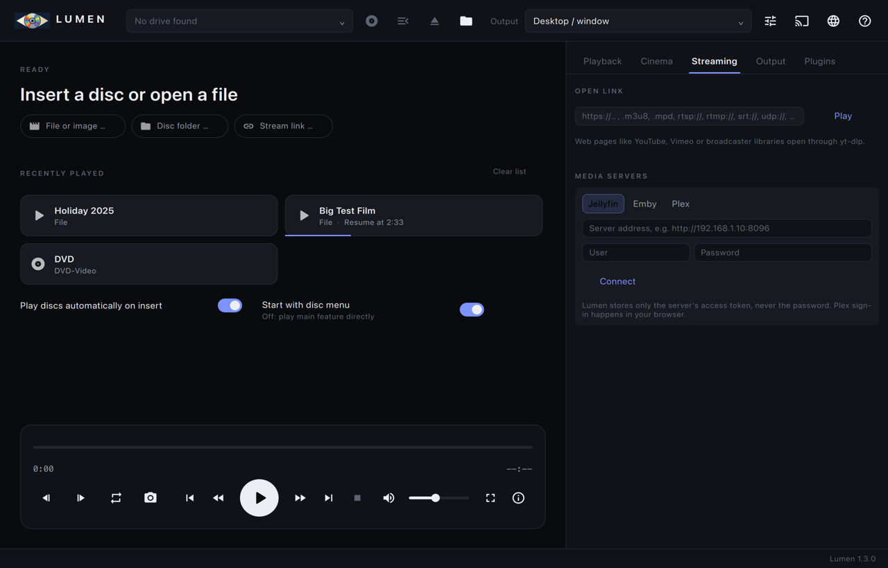
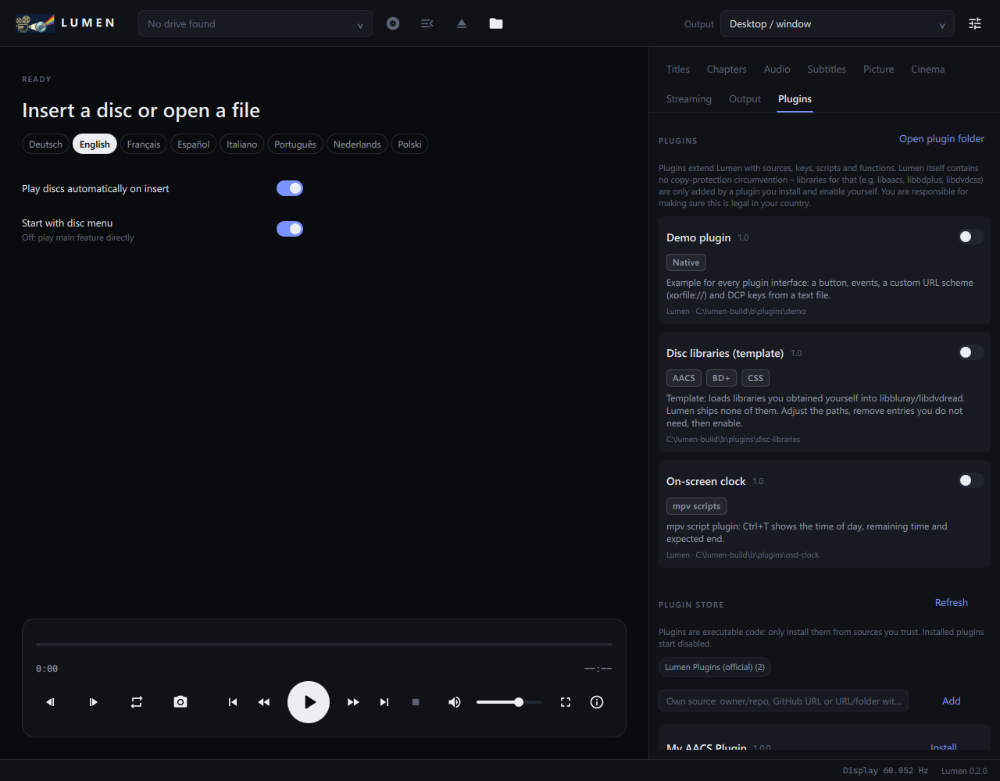
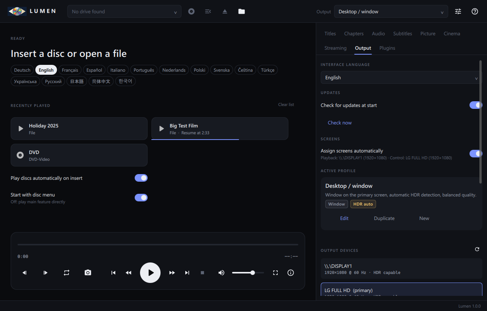

<p align="center"></p>

# Lumen – Disc- & Digitalkino-Player

[English](README.md) · **Deutsch** · [Français](README.fr.md) · [Español](README.es.md) · [Italiano](README.it.md) · [Português](README.pt.md) · [Nederlands](README.nl.md) · [Polski](README.pl.md) · [Svenska](README.sv.md) · [Čeština](README.cs.md) · [Türkçe](README.tr.md) · [Українська](README.uk.md) · [Русский](README.ru.md) · [日本語](README.ja.md) · [简体中文](README.zh.md) · [한국어](README.ko.md)

Schneller, minimalistischer Player für Heimkinos, Vorführräume und kleine Kinos mit **zwei Fenstern**:

- **Player-Fenster** – natives mpv-Fenster (gpu-next, D3D11/Vulkan/Wayland), fest auf ein Ausgabegerät legbar, HDR-Passthrough.
- **Steuerfenster** – Qt Quick: Quelle, Transport, Titel, Kapitel, Ton, Untertitel, Bild, Kino, Ausgabeprofile.

Spielt **Blu-ray / UHD / Blu-ray 3D, DVD-Video (mit Menüs), HD DVD, Video-CD / Super Video-CD, Audio-CD,
Digital Cinema Packages (DCP, JPEG 2000, SMPTE und Interop, verschlüsselt mit KDM)** und alle Dateiformate, die mpv abspielt.

## Screenshots (englische Oberfläche)

<p align="center">
  
  
</p>
<p align="center">
  
  
</p>
<p align="center">
  
</p>

## Kopierschutz / Verschlüsselung

Lumen **umgeht keinen Kopierschutz**. Alles in dieser Richtung ist Entscheidung des Nutzers und läuft über
**[Plugins](plugins/README.md)**, die er selbst installiert und aktiviert: Ein Plugin kann vom Nutzer beschaffte
Bibliotheken (libaacs, libbdplus, libdvdcss) für libbluray/libdvdread bereitstellen, eigene entschlüsselnde
URL-Schemata anmelden oder DCP-Schlüssel liefern. Lumen liefert nichts davon mit und lädt nichts davon herunter.

- **Blu-ray:** Discs werden ausschließlich über `libbluray` gelesen. Ist eine Disc AACS/BD+-geschützt, muss das außerhalb
  von Lumen bereits gelöst sein – z. B. ein Laufwerk mit LibreDrive-Firmware plus eine vom Nutzer installierte
  AACS-Bibliothek, die libbluray zur Laufzeit selbst lädt. Das gilt auch für die zweite 3D-Ansicht (`bd_open_file_dec`).
- **DVD:** Zugriff über `libdvdread`/`libdvdnav`; Lumen enthält keinen CSS-Code. Die MSYS2- und Homebrew-Builds von libdvdread
  sind fest gegen `libdvdcss` gelinkt. In Lumens Windows- und macOS-Paketen liegt deshalb unter diesem Namen **Lumens
  eigener Ersatz** (`src/dvdcss_shim.c`) statt libdvdcss. Er liest Sektoren unverändert, damit laufen unverschlüsselte Discs,
  Abbilder und Ordner. Stellt der Nutzer per Plugin eine echte libdvdcss bereit, reicht der Ersatz an sie durch
  (`LUMEN_DVDCSS_LIBRARY`).
- **HD DVD:** nur ungeschützte (bzw. bereits entschlüsselte) Discs; AACS-geschützte HD DVDs werden als solche gemeldet.
- **DCP:** verschlüsselte DCPs werden entschlüsselt wie auf jedem Kinoserver – mit einem **für das Zertifikat dieses Players
  ausgestellten KDM** (siehe unten). Ohne passenden, gültigen KDM (oder vom Rechteinhaber selbst eingetragene Schlüssel)
  bleibt verschlüsselter Inhalt unlesbar.

## Downloads

Fertige Builds gibt es auf der [Release-Seite](https://github.com/Karl-Lauterbach24/Lumen/releases):

| System | x86-64 | ARM64 |
|--------|--------|-------|
| Windows 10/11, Installer | `Lumen-<version>-windows-x64.msi` | `Lumen-<version>-windows-arm64.msi` |
| Windows 10/11, portabel | `Lumen-<version>-windows-x64.zip` | `Lumen-<version>-windows-arm64.zip` |
| macOS 15 | `Lumen-<version>-macos-x64.dmg` (Intel) | `Lumen-<version>-macos-arm64.dmg` (Apple Silicon) |
| Debian 13 und Abkömmlinge | `Lumen-<version>-linux-amd64.deb` | `Lumen-<version>-linux-arm64.deb` |
| Fedora 44 | `Lumen-<version>-linux-x86_64.rpm` | `Lumen-<version>-linux-aarch64.rpm` |

- Das MSI installiert für alle Benutzer mit Startmenü-Eintrag; Deinstallation über *Apps & Features*.
- Linux: `sudo apt install ./Lumen-….deb` bzw. `sudo dnf install ./Lumen-….rpm`; die Paketverwaltung holt
  Qt 6 und die Disc-Bibliotheken dazu.
- Jedes Paket enthält dieselben Medienbibliotheken, aus denselben festgelegten Quellen gebaut: FFmpeg-mvc
  (mit dem Blu-ray-3D-Decoder), libmpv und x264. Blu-ray 3D und das Übertragen arbeiten deshalb auf allen
  Plattformen gleich.
- Die Oberfläche gibt es in 16 Sprachen (Startseite). Deutsch und Englisch sind von Hand gepflegt, die
  übrigen Übersetzungen entstanden mit maschineller Hilfe – Korrekturen sind willkommen.
- Neu in 1.1: Übertragen an Fernseher und Empfänger (DLNA, Chromecast, AirPlay, Lumen-TV-Apps, Browser),
  Blu-ray 3D in allen Paketen, experimentelle 3D-Bildfolge für Shutterbrillen.

Lumen sucht beim Start nach neuen Versionen, höchstens einmal täglich und nur wenn eingeschaltet. Ein Update
installiert es mit einem Klick, nachdem es den Download gegen die `SHA256SUMS.txt` des Releases geprüft hat.

## Streaming und Medienserver

Der Reiter **Streaming** spielt Links aller Art, die mpv versteht: HTTP(S)-Dateien, HLS (`.m3u8`), DASH (`.mpd`),
RTSP, RTMP, SRT, UDP und SMB. Er merkt sich die zuletzt geöffneten Links. Webseiten wie YouTube laufen über
[yt-dlp](https://github.com/yt-dlp/yt-dlp), wenn es neben Lumen oder im `PATH` liegt.

Medienserver:

| Server | Anmeldung | Funktionen |
|--------|-----------|------------|
| **Jellyfin**, **Emby** | Benutzer + Passwort; gespeichert wird nur das Zugriffstoken | Bibliotheken, Serien/Staffeln/Folgen, Suche, Weiterschauen, Cover, Direktwiedergabe ab Fortsetzungspunkt, Fortschritt an den Server |
| **Plex** | *Mit Plex anmelden* per PIN im eigenen Browser oder Server-URL + `X-Plex-Token` | Bibliotheken, Serien/Staffeln/Folgen, Suche, Weiterschauen, Cover, Direktwiedergabe, Fortschritt über die Timeline |

## Übertragen

Der Knopf „Übertragen“ im Steuerfenster sendet Bild und Ton des Players an einen Fernseher oder Empfänger im
selben Netz. Lumen kodiert genau das, was sonst im Player-Fenster stünde (Disc-Menüs, Untertitel und
Tonemapping inklusive), als H.264 mit AAC-Stereoton in 1080p oder 720p und liefert den Strom selbst aus;
gesteuert wird weiter in Lumen.

| Empfänger | Wie | Hinweise |
|-----------|-----|----------|
| **DLNA/UPnP**-Renderer (die meisten Smart-TVs) | automatisch gefunden (SSDP) oder über die Adresse der Gerätebeschreibung | fortlaufender MPEG-TS-Strom |
| **Chromecast / Google Cast** | automatisch gefunden (mDNS) oder über die IP-Adresse | HLS im Standard-Medienempfänger |
| **AirPlay** | automatisch gefunden (mDNS) oder über die IP-Adresse | nur Empfänger, die Video ohne Kopplung annehmen; die meisten aktuellen Apple TVs und AirPlay-2-Fernseher lehnen ab (Lumen meldet das) |
| **[Lumen-TV](https://github.com/Karl-Lauterbach24/Lumen-TV)**-Apps: Android TV, Samsung Tizen, LG webOS | die App verbindet sich mit Lumen und erscheint in der Liste | die Fernbedienung des Fernsehers bedient Lumen: Disc-Menüs, Pause, Spulen |
| jeder **Browser** | die im Dialog gezeigte Adresse öffnen, z. B. `http://192.168.1.20:47800` | dieselbe Empfänger-Seite wie in den TV-Apps |
| **Miracast**, AirPlay-Bildschirmsynchronisierung | Knopf im Dialog öffnet die Einstellung des Systems | der Empfänger wird ein normaler Bildschirm; nichts wird umkodiert |

- Der Strom ist live und kommt über HLS drei bis vier Sekunden verzögert an. Für Filme ist das unerheblich,
  Disc-Menüs reagieren mit dieser Verzögerung.
- HDR wird auf SDR abgebildet, Mehrkanalton auf Stereo gemischt, 3D in 2D übertragen.
- Lumen lauscht auf Port 47800 nur, solange der Dialog offen ist oder übertragen wird – außer
  „Für Lumen-TV-Apps erreichbar bleiben“ ist eingeschaltet. Die Adresse des Stroms enthält je Sitzung ein
  zufälliges Token. Das Protokoll der TV-Apps steht in [docs/tv-protocol.md](docs/tv-protocol.md).
- Automatisch getestet gegen Nachbildungen aller vier Empfängerarten und durch Abspielen des Stroms in einem
  Desktop-Browser. **Nicht mit einem echten Fernseher, Chromecast, AirPlay- oder DLNA-Gerät getestet.**

## Bildschirme

Ist als Ausgabe *Automatisch* eingestellt (Standard), ordnet Lumen die Bildschirme selbst zu:
- die Wiedergabe läuft auf dem Bildschirm mit den meisten Pixeln (danach zählen Bildrate und HDR);
- das Steuerfenster wandert auf den kleinsten übrigen, z. B. den Laptop neben dem Projektor.

Beim Ein- und Ausstecken von Bildschirmen passt Lumen die Zuordnung an. Abschalten lässt sich das im Reiter *Ausgabe*.

## Plugin-Store

Der Reiter *Plugins* installiert Plugins aus dem offiziellen Store
[Lumen-Plugins](https://github.com/Karl-Lauterbach24/Lumen-Plugins) und aus eigenen Quellen. Eine Quelle kann
`owner/repo` sein, eine GitHub-URL oder eine URL bzw. ein Ordner mit `index.json`. Jede Datei wird gegen ihre
SHA-256-Summe geprüft, und neu installierte Plugins sind zunächst aus.

## Plugins

Ordner mit einer `plugin.json`, verwaltet im Reiter **Plugins** (aktivieren, deaktivieren, Schaltflächen, Status).
Ein Plugin kann Folgendes mitbringen, beliebig kombiniert:
- eine native C-ABI-Bibliothek ([`include/lumen/plugin.h`](include/lumen/plugin.h)): Ereignisse,
  Schaltflächen, eigene URL-Schemata als Quellen, DCP-Inhaltsschlüssel, mpv-Befehle/-Eigenschaften;
- mpv-Skripte (Lua/JavaScript);
- mpv-Optionen;
- Umgebungsvariablen;
- vom Nutzer bereitgestellte Disc-Bibliotheken.

Doku und Beispiele: [plugins/README.md](plugins/README.md) (englisch).

## Funktionen

| Bereich | Umfang |
|---|---|
| Quellen | Optische Laufwerke (Auto-Erkennung, Hersteller/Modell/Firmware, Auswerfen, Autostart beim Einlegen), ISO (Blu-ray/DVD/HD DVD automatisch erkannt), CUE/BIN/NRG-Abbilder, Disc-Ordner (BDMV, VIDEO_TS, HVDVD_TS, MPEGAV/MPEG2), DCP-Ordner und Kino-Festplatten, alle Formate, die mpv abspielt |
| Blu-ray | Disc-Menüs (HDMV, BD-J mit Java), Hauptfilm, Titel/Playlists mit Laufzeit, Video-/Tonformat, UHD- und 3D-Erkennung |
| **Blu-ray 3D** | **Beide Ansichten (MVC)**, Ausgabe als HDMI Frame Packing 1080p, Side-by-Side/Top-and-Bottom (Half/Full), Zeilenverschachtelt, Anaglyph oder 2D; Untertitel und Menüs je Auge mit einstellbarer Tiefe |
| **DVD-Video** | **Disc-Menüs** über libdvdnav (Haupt-/Titel-/Ton-/Untertitelmenü, Buttons per Tastatur, Fernbedienung und Maus), Standbilder, eigener Subpicture-Dekoder mit Disc-Palette und Button-Hervorhebung, erzwungene Untertitel, Mehrfachwinkel, Sprachen aus der IFO, Region/Sprache aus den Systemeinstellungen, Titel- und Kapitelwahl |
| **DCP** | SMPTE und Interop, OV/VF (Ergänzungspakete in Nachbarordnern), mehrrollige CPLs mit Einstiegspunkten, **JPEG 2000 (XYZ → Anzeigefarbraum)**, 24-Bit-PCM bis 16 Kanäle, **verschlüsselte DCPs (KDM, AES-128)**, Untertitel (Interop-XML und SMPTE Timed Text inkl. verschlüsseltem MXF und eingebetteten Schriften → positioniertes ASS), **CPL-Marker als Kapitel** (FFOC, LFOC, FFEC, FFMC …), **3D-DCPs**, Prüfsummen-Kontrolle gegen die PKL |
| HD DVD | Titel und Kapitel aus den Advanced-Content-Playlists (ADV_OBJ/*.XPL), EVO-Wiedergabe (VC-1/AVC/MPEG-2, DD+, DTS-HD, TrueHD) |
| Video-CD / SVCD | Sektorgenaues Lesen der Mode-2-Form-2-Tracks über libcdio (Laufwerk oder CUE/BIN/NRG), Einsprungpunkte (ENTRIES.VCD/SVD) als Kapitel, **PBC-Menüs** (VCD-2.0-Wiedergabesteuerung: Auswahllisten per Zifferntaste, Wiedergabelisten, Weiter/Zurück/Return/Default, Wartezeiten, Schleifen, Segment-Standbilder), Rückfall über das Dateisystem |
| Audio-CD | Tracks als Kapitel (mpv cdda) |
| Transport | Play/Pause, Stopp, ±10 s/±60 s, Kapitel, Einzelbild vor/zurück, A-B-Schleife, Geschwindigkeit, Scrubbing mit Kapitelmarken, Screenshot, **Vorführprogramm** (Werbung, Trailer, Hauptfilm nacheinander) |
| Ton | Spurwahl, Bitstream (TrueHD/Atmos, DTS-HD MA/DTS:X, DD+, DD), WASAPI exklusiv, Kanal-Layout, Audio-Verzögerung; **Kino-Fader** (Dolby-Skala, 7,0 = Referenz) und **DCP-Kanalbelegung** (5.1, 7.1 DS, HI, VI-N) |
| Untertitel | Spurwahl (PGS/SRT/ASS/VobSub/DCP), nur erzwungene, Verzögerung, Größe, Position (Cinemascope-Leinwand) |
| Bild | Seitenverhältnis, Pan & Scan, Zoom, Helligkeit/Kontrast/Sättigung/Gamma, automatisches Deinterlacing, **automatische 3D-Erkennung für Dateien** (Side-by-Side, Top-and-Bottom, MVC in MKV) oder ein von Hand gewähltes Format |
| Ausgabeprofile | Zielgerät, Vollbild, Bildraten-Anpassung, System-HDR automatisch, HDR-Passthrough oder Tonemapping, **Referenz-Skalierung** (EWA Lanczos 4, Error Diffusion, HDR-Kontrastrückgewinnung), **Kalibrierung** (System-/eigenes ICC-Profil, 3D-LUT `.cube`, nativer Kontrast, Dither-Tiefe, GLSL-Shader), Sync, 3D-Ausgabeformat, Audiogerät, Experten-Optionen |

Vorlagen: *Desktop*, *1080p DLP 3D-Beamer* (Half-SBS), *1080p DLP 3D-Beamer (Frame Packing)*,
**Kino-Projektor DCI-P3 (Gamma 2.6, 48 cd/m²)**, **Mastering-Monitor P3-D65**,
*4K HDR LED-Projektor (Passthrough)*, *4K HDR LED-Projektor (Player-Tonemapping)*, *4K HDR TV (OLED)*, *Leistung/Laptop*.

## Digital Cinema Packages

```
ASSETMAP ─> PKL ─> CPL (Rollen: Bild | Ton | Untertitel | Marker)
                     │
                     ├─ Bild-MXF    ─ lumendcp:// (entschlüsselt beim Lesen) ─ FFmpeg J2K ─ XYZ → Anzeige
                     ├─ Ton-MXF     ─ lumendcp://                            ─ PCM 24 Bit ─ Fader / Kanalbelegung
                     ├─ Untertitel  ─ Interop-XML / SMPTE Timed Text          ─ positioniertes ASS (+ Schriften)
                     └─ Marker      ─ Kapitel
             alle Rollen ─> eine mpv-EDL (3D: linkes + rechtes Auge → lavfi hstack → 3D-Ausgabeformat)
```

- **Öffnen:** Tab „Kino“ → *DCP öffnen …*, der Ordner-Dialog, DCP-Ordner auf der Kommandozeile, oder eine Kino-Festplatte
  anschließen: DCPs im Wurzelordner oder eine Ordnerebene tiefer erscheinen in der Laufwerksliste.
- **Verschlüsselte DCPs / KDM-Ablauf**
  1. *Kino → Zertifikat erzeugen* legt eine Zertifikatskette nach SMPTE ST 430-2 an (RSA 2048, SHA-256).
     Alternativ übernimmt *Importieren …* ein vorhandenes Leaf-Zertifikat samt privatem Schlüssel (PEM), z. B. aus DCP-o-matic.
  2. *Leaf exportieren* – `lumen-leaf.pem` an den Verleih bzw. KDM-Ersteller senden.
  3. *KDM laden …* – die Inhaltsschlüssel werden per RSA-OAEP ausgepackt; KDMs werden (weiter verschlüsselt) im
     Konfigurationsordner abgelegt und bei jedem Start neu ausgepackt. Gültigkeitszeiträume werden geprüft; die CPL-Liste
     zeigt „KDM gültig bis …“, „abgelaufen“ oder „noch nicht gültig“.
  4. Bei der Wiedergabe wird jedes KLV-Triplet (SMPTE ST 429-6, AES-128-CBC) im Lesestrom entschlüsselt und durch
     *Essenz-KLV + gleich großes KLV-Fill* ersetzt – alle Index-Tabellen und Partitions-Offsets bleiben gültig, Spulen
     funktioniert. Ein falscher Schlüssel fällt über den Prüfwert des Triplets auf.
  - Für eigene DCPs nimmt *Schlüsseldatei …* Zeilen `<Key-ID> <Schlüssel-Hex>` an (nur für die Sitzung, nicht gespeichert).
- **JPEG-2000-Leistung:** J2K ist in Auflösungsstufen kodiert. Im Modus *automatisch* dekodiert Lumen nur die Stufe, die die
  Ausgabe braucht (4K-DCP auf 2K/1080p = halbe Arbeit ohne sichtbaren Verlust) und wechselt, wenn die CPU nicht mithält
  (verworfene Bilder in den ersten 30 s), im laufenden Betrieb eine Stufe tiefer. Von Hand: voll / halb / Viertel.
- **Ton:** 16-Kanal-DCPs werden nach SMPTE 428-12 zugeordnet (L R C LFE Ls Rs · HI · VI-N · … · Lrs Rrs); *automatisch* nutzt
  7.1 DS bei 16 Kanälen, sonst 5.1; HI und VI-N sind für Barrierefreiheit wählbar. Der Fader folgt der Skala der
  Kinoprozessoren (7,0 = 0 dB, 3,33 dB je Einheit oberhalb 4).
- **Immersive Audio (Dolby Atmos / SMPTE IAB):** Atmos-Spuren in DCPs (`AuxData`, ST 429-18) enthalten IAB-Frames nach
  SMPTE ST 2098-2. Lumen liest sie Frame für Frame, entschlüsselt sie mit dem KDM-Schlüssel (Typ MDEK) und rendert Betten
  und Objekte mit dem offenen [IAB-Renderer](https://github.com/DTSProAudio/iab-renderer) von DTS (BSD-3-Clause, VBAP) auf
  **7.1.4, 5.1.4, 7.1, 5.1 oder Stereo** (*Kino → Atmos/IAB-Ausgabe*). Das Ergebnis geht als 32-Bit-Float-WAV mit
  Kanalmaske an mpv und ist die bevorzugte Tonspur der Komposition; die PCM-Fassung bleibt wählbar.
  - Die 5.1/7.1-Layouts sind aus DTS' 5.1.4/7.1.4 abgeleitet, die Höhen werden dabei heruntergemischt (`resources/iab`).
  - Der Renderer wird beim Bauen automatisch geholt (festgelegter Commit) oder aus `-DIAB_SOURCE_DIR` genommen;
    `-DLUMEN_WITH_IAB=OFF` baut ohne ihn.
- **Prüfung:** *Prüfen* bildet die SHA-1-Summen aller Spurdateien einer CPL und vergleicht sie mit der Packing List.
- **Vorführprogramm:** CPLs (*Ins Programm*) oder die laufende Quelle hinzufügen und nacheinander abspielen.

## Blu-ray 3D

```
libbluray bd_read_ext()  ── Basisansicht (PID 0x1011) ─────┐
                                                            ├─ MvcMerger ─ TS ─> mpv ─> FFmpeg-mvc ─> SBS-Bild
libbluray bd_open_file_dec() ─ abhängige Ansicht (0x1012) ─┘   (je Bild per PTS gepaart)            │
                                                                                                     v
                                          vf: stereo3d / Frame-Packing-Graph ─> Format des Ausgabeprofils
```

- **Decoder:** Standard-FFmpeg dekodiert nur die Basisansicht. Lumen nutzt
  [FFmpeg-mvc](https://github.com/tthayer93/FFmpeg-mvc) (Branch `release/9.0`), das beide Ansichten zu einem
  Side-by-Side-Bild dekodiert. `tools/build_deps.sh` baut es und libmpv dagegen, für jede Plattform.
  Lumen erkennt den Decoder an der Versionskennung (`…-mvc`).
- **Zweite Ansicht:** libbluray liefert nur die Basisansicht. `MvcMerger` liest den SS-Subpfad der Playlist
  (welcher Clip), die CLPI-EP-Map (Sprungpunkte) und die abhängige `.m2ts` über libbluray, paart Access Units
  per PTS und hängt die MVC-NAL-Units an die der Basisansicht an.
- **3D-Wiedergabe läuft immer über libbluray** (`lumenbd://`), auch „Hauptfilm“ und Titelwahl.
  Der Disc wird „3D bevorzugt“ gemeldet (PSR21/23), damit Menüs die 3D-Playlist wählen.
- **Untertitel/Menüs:** libbluray rendert PG-Untertitel und Menügrafik; Lumen zeichnet sie einmal je Auge
  (Tiefe im Profil bzw. im Tab „Untertitel“ einstellbar).
- **Frame Packing (HDMI 1.4):** 1920×2205 (1080 + 45 + 1080 Zeilen) @ 23.976 Hz. Der Anzeigemodus muss im
  Grafiktreiber als benutzerdefinierte Auflösung angelegt sein; Lumen schaltet dann automatisch darauf um.
- MVC kann keine GPU dekodieren; erkannte 3D-Discs werden in Software dekodiert.

- **Bildfolge für Shutterbrillen (experimentell):** Das Ausgabeformat „Bildfolge“ zeigt je Bildwechsel ein
  Auge. Das Muster ist frei: `LR`, `LSRS` (Synchronbild nach jedem Auge – ein Versuch, DLP-Link-Brillen an
  einem schnellen Fernseher zu takten), `LBRB` (Schwarzbilder) oder eine eigene Folge aus L, R, S und B. Farbe
  und Helligkeit der Synchronbilder, ein Messfeld in einer Bildschirmecke für Lichtsensoren, Augentausch,
  eine Verschiebung des Musters und das Umschalten des Bildschirms auf die gewählte Rate (120 bis 360 Hz)
  stehen im Ausgabeprofil. Die Bildfolgen sind getestet; **ob eine Brille darauf einrastet, ist nicht
  getestet**, und ein einziges ausgelassenes Bild vertauscht die Augen.

## 3D-Dateien

Lumen stellt selbst fest, ob eine Datei 3D ist und wie die beiden Augen angeordnet sind (Reiter *Bild*,
3D-Quelle *Automatisch*). Vier Quellen, in dieser Reihenfolge:

1. **Was die Datei sagt:** Matroska `StereoMode`, MP4 `st3d`, H.264-SEI zum Frame Packing, von mpv gelesen.
2. **Der Dateiname:** `3D`, `SBS`, `H-SBS`, `Half-SBS`, `FSBS`, `TAB`, `HTAB`, `OU`, `H-OU`, `Over-Under`,
   `Top-and-Bottom`, `RL` (rechtes Auge zuerst). `SBS` allein ist auch ein Sendername; ohne `3D` oder
   Größenangabe zählt es nur, wenn das Bild nicht dagegen spricht. `OU` und `TAB` allein brauchen ein `3D` daneben.
3. **Das Bild:** bis zu sieben Bilder, über die Laufzeit verteilt, werden dekodiert und ihre Hälften verglichen
   (links/rechts und oben/unten, um bis zu 6 % gegeneinander verschoben; vorher wird alles abgezogen, was
   entlang einer Zeile oder Spalte gleich bleibt – Balken, Streifen und schwarze Ränder sehen sonst wie eine
   zweite Ansicht aus). Zwei Ansichten derselben Szene gleichen sich zu 0,75 bis 0,98, gewöhnliche Bilder zu
   etwa 0. Drei Bilder ohne jede Ähnlichkeit beenden die Prüfung vorzeitig – der Normalfall, er dauert den
   Bruchteil einer Sekunde.
4. **Die Bildgröße** (3840×1080, 1920×2160) – nur, wenn der Name 3D sagt und sich das Bild nicht prüfen ließ.

Ob jedes Auge die volle oder die halbe Auflösung hat, ergibt sich aus der Form einer Hälfte: schmaler als
1,3:1 (nebeneinander) oder breiter als 3:1 (übereinander) heißt gestaucht.

**MKV mit zwei Ansichten (H.264/MVC,** z. B. aus einer Blu-ray 3D erstellt): FFmpeg-mvc meldet das Profil
*Stereo High*. Gibt das Ausgabeprofil 3D aus, dekodiert Lumen beide Ansichten (Software-Decoder,
Matroska-Leser von FFmpeg) und behandelt das Ergebnis wie eine Datei in Side-by-Side Full; mit einem
2D-Profil wird nur die Basisansicht dekodiert.

Gibt das Ausgabeprofil 3D aus oder sagt der Name 3D, läuft die Prüfung **vor** dem Start der Datei (sie
wartet höchstens 2,5 s) – die Wiedergabe beginnt gleich im richtigen Format. Sonst läuft sie direkt danach;
eine 3D-Datei auf einem 2D-Profil springt nach etwa einer Sekunde auf ein Auge um. Ein von Hand gewähltes
Format schaltet die Erkennung ab. Nicht erkannt werden: welches Auge zuerst kommt (angenommen wird links,
außer der Name sagt `RL`), Anaglyph, Schachbrett. `LUMEN_STEREO_DEBUG=1` gibt jede Entscheidung aus.

## Hardware und Leistung

- **Skalierungsqualität *Automatisch*** wählt die Stufe nach der Grafikhardware: *Schnell*, wenn ein
  Software-Renderer gefunden wird (llvmpipe, SwiftShader, Microsoft Basic Render Driver), *Ausgewogen* bei
  integrierter Grafik, *Hoch* bei Grafikkarten und Apple Silicon. Der Treiber wird einmal gefragt, über einen
  OpenGL-Kontext ohne Fenster; der Profil-Editor zeigt, was er geantwortet hat.
- **Hardware-Decoding *Automatisch*** dekodiert auf der Grafikhardware und reicht die Bilder direkt an den
  Renderer. Rechnet ein Filter auf der CPU (3D-Umrechnung), kopiert der Decoder sie in den Arbeitsspeicher,
  statt sie den Umweg gehen zu lassen; für MVC ist es aus – das kann kein Hardware-Decoder. Was die
  Hardware nicht dekodieren kann (Codec, Profil oder Größe nicht unterstützt), übernimmt von selbst der
  Software-Decoder.
- **Anpassung zur Laufzeit** (*Leistung automatisch anpassen* im Profil): Einmal je Sekunde sieht Lumen auf
  die verworfenen und verspäteten Bilder. Ab 6 % über 3,5 s (oder 25 % über 2 s) nimmt es schrittweise zurück:
  beim Renderer je eine Skalierungsstufe, bis *Schnell* ohne Debanding und Dithering; beim Software-Decoder
  erst Abkürzungen, die man nicht sieht, dann den Deblocking-Filter, zuletzt lässt er Bilder aus, damit der
  Ton nicht davonläuft. Misst der Renderer seine Zeit selbst, entscheidet das, welche Seite zu langsam ist;
  sonst wechseln sich beide ab, bei 4K und mehr der Decoder zuerst. Das Steuerfenster zeigt, was
  zurückgenommen wurde. Die Renderstufe wird je Profil und Art des Materials (Größe und Bildrate) 14 Tage
  gemerkt.
- **Deinterlacing** ist automatisch für Material, das als Halbbild gekennzeichnet ist; der Schalter im
  Reiter *Bild* erzwingt es.
- Im eigenen Fenster verlangt Lumen von mpv `gpu-next` und, wenn der nicht startet, den älteren Renderer `gpu`.
- **Start ohne verlorene Bilder.** Eine Datei wird angehalten geladen und läuft los, wenn ihr erstes Bild
  gezeichnet ist; ein Software-Decoder bekommt noch einmal so lange, wie er für dieses Bild gebraucht hat – seine
  Threads arbeiten da noch an den nächsten. Ohne das verwirft mpv die ersten Bilder, während der Ton schon läuft.
  Gezählt wird ab diesem Start.
- **JPEG 2000 (DCP).** Mit Lumens Änderung an FFmpeg ist der Decoder 20 bis 28 % schneller. Gemessen auf einem
  Apple M3 Pro (12 Threads): 2K mit 183 Mbit/s 50 Bilder je Sekunde (vorher 42), 4K mit 271 Mbit/s 27 (vorher
  etwa 22), 4K mit 293 Mbit/s 26 (vorher 21). 4K mit 24 Bildern je Sekunde läuft dort jetzt in voller Auflösung
  ohne verworfene Bilder; vorher nicht. Eine langsamere Maschine weicht weiterhin von selbst auf die halbe
  Auflösung aus.
- `LUMEN_PERF_LOG=1` schreibt je Sekunde: Position, verworfene und verspätete Bilder, Decoder-Weg, zurückgenommene Stufen
  und wie oft das eingebettete Fenster gezeichnet wurde. `LUMEN_QUIT_AFTER=<Sekunden>` beendet das Programm von selbst (Testläufe).

## DVD-Menüs

- libdvdnav führt die virtuelle Maschine der DVD aus und liefert MPEG-PS über `lumendvd://` an mpv.
- mpv kennt die DVD-Palette nicht; Lumen ersetzt die Subpicture-Pakete im Strom durch Füllpakete und dekodiert sie selbst
  (Lauflängen, Steuersequenzen, IFO-Palette, Button-Farben) – Menüs und Untertitel werden als Overlay auf die Bildfläche
  skaliert, Untertitel per PTS zur Wiedergabezeit synchronisiert.
- Standbild-Menüs: Lumen fügt ein Sequenzende ein, damit der Decoder das Standbild sofort ausgibt.
- Bedienung: Pfeile/Enter/Maus im Player-Fenster, Steuerkreuz im Steuerfenster, Pos1 = Hauptmenü, Ende = Titelmenü,
  Tasten für Ton-/Untertitelmenü, „Zurück“ und Winkelwechsel.

## Architektur

```
src/MpvController   libmpv-Instanz, ereignisgesteuerte Property-Beobachtung, Profile -> mpv-Optionen, Quellenwahl, Vorführprogramm
src/BlurayNav       libbluray als mpv-Stream "lumenbd://": Menüs, Titel, 3D, Overlays je Auge
src/MvcMerger       Blu-ray 3D: mischt die abhängige Ansicht zu (SS-Subpfad, EP-Map, PTS-Paarung)
src/DvdNav          libdvdnav als mpv-Stream "lumendvd://": Menüs, SPU-Dekoder, Hervorhebung, Spuren, Winkel
src/OpticalMedia    Video-CD/SVCD ("lumenvcd://", libcdio), Audio-CD, HD DVD (XPL-Playlists, EVO)
src/DcpPackage      DCP: ASSETMAP/PKL/CPL-Parser, MXF-Kopf (Auflösung, Kanäle, 3D, Verschlüsselung)
src/DcpCrypto       OpenSSL: Zertifikatskette (SMPTE 430-2), KDM auspacken (RSA-OAEP), AES-128-CBC
src/DcpStream       "lumendcp://": MXF-Leser mit größengleicher Triplet-Entschlüsselung und Augenfilter
src/DcpSubtitles    Interop/SMPTE-Untertitel -> ASS, eingebettete Schriften
src/DcpManager      DCP-Ablauf für die Oberfläche: Pakete, Schlüssel, EDL/Kapitel, Fader, Kanäle, J2K-Stufen, Prüfung
src/DisplayManager  Ausgabegeräte, Bildrate / HDR / Frame-Packing-Modus (Windows, xrandr, kscreen-doctor, CoreGraphics)
src/DriveManager    Laufwerke/Discs/Kino-Festplatten (Worker-Thread), Auswerfen
src/DiscScanner     Titel und Status für Blu-ray, DVD, HD DVD, VCD, Audio-CD (Worker-Thread)
src/PlayerWindow    eingebettetes Player-Fenster (mpv-Render-API/OpenGL, eigener Zeichen-Thread), vor allem für macOS
src/ProfileManager  Vorlagen + eigene Profile
src/Stereo3D        Filterketten der 3D-Ausgabeformate, auch Bildfolge
src/StereoDetect    automatische 3D-Erkennung: Dateiname, Container, Bildvergleich, MVC
src/Tuning          Klasse der Grafikhardware, Skalierungsstufe und Decoder-Weg, Governor zur Laufzeit
src/CastManager     Übertragen: Sitzung, Einstellungen, Geräteliste (QML „Cast“)
src/CastRenderer    mpv-Render-API in einen Framebuffer, ausgelesen für den Encoder
src/CastEncoder     H.264 + AAC -> MPEG-TS-Segmente (libavcodec/libavformat), eigener Thread
src/CastAudio       ordnet den Ton von mpv auf der Zeitachse des Stroms an (Ton-Abgriff in Lumens libmpv)
src/CastServer      HTTP: HLS, fortlaufender TS-Strom, Empfänger-Seite, Lumen-TV-Protokoll
src/CastDiscovery   SSDP (DLNA) und mDNS (Chromecast, AirPlay)
src/CastTargets     DLNA AVTransport, Chromecast CASTV2, AirPlay, Lumen TV
receiver/           Empfänger-Seite für Browser und die TV-Apps
qml/                Steuerfenster (CinemaPane.qml = Tab „Kino“)
tools/              Build-/Deploy-Skripte, Generatoren für Test-Discs/-DCPs/-VCDs
tests/              mvcmerge_test (MVC-Zusammenführung), dcp_test (DCP-Kette)
```

## Bauen

Lumen braucht Qt ≥ 6.5 (Quick, QuickControls2, OpenGL, Xml), libbluray ≥ 1.2, CMake ≥ 3.21 und seine
Medienbibliotheken. Optional und automatisch aktiv, wenn gefunden: **OpenSSL ≥ 1.1** (verschlüsselte DCPs),
**libdvdnav ≥ 6** (DVD-Menüs), **libcdio + libiso9660** (Video-CD von Laufwerk und Abbild).

**Medienbibliotheken.** `tools/build_deps.sh` baut x264, FFmpeg-mvc und mpv (und libdvdnav 7, wo das System
eine ältere hat) aus festgelegten Quellen nach `3rdparty/prefix`; CMake findet dieses Präfix von selbst. Die
Versionen stehen oben im Skript, einmal für alle Plattformen. mpv bekommt drei kleine Änderungen
([`tools/patches`](tools/patches)): eine Korrektur an der Gewichtstabelle der Skalierer (uninitialisierte
Füllwerte, mit OpenGL auf der CPU ein schwarzes Bild), und seine zeitgesteuerte Null-Tonausgabe kann die Samples zusätzlich in eine
Pipe schreiben, mit dem Zeitpunkt, zu dem jeder Block gespielt wird. Das braucht die Übertragung; ein
unverändertes libmpv spielt alles andere, der Knopf „Übertragen“ ist dann gesperrt. Die dritte lässt den Ton
anlaufen, wenn ein Tongerät den Bitstream ablehnt: mpv weicht dann auf das Dekodieren aus, nur fragte niemand
mehr den Decoder nach Daten, und die Wiedergabe blieb bei 0:00 stehen. FFmpeg bekommt eine
Änderung: Der JPEG-2000-Decoder (DCP) rechnet die Wavelet-Rücktransformation über benachbarten Speicher statt
Spalte für Spalte, und der arithmetische Decoder ist in die Kodierdurchgänge eingebettet. Die dekodierten
Bilder sind Bit für Bit dieselben.

Alles Übrige (Qt, libass, libplacebo, libbluray …) kommt aus der Paketverwaltung der Plattform. Die genauen
Paketlisten stehen in den Workflows: [`release.yml`](.github/workflows/release.yml) (Windows, macOS) und
[`linux.yml`](.github/workflows/linux.yml).

### Windows (MSYS2 UCRT64 bzw. CLANGARM64 auf ARM)

```bash
pacman -S --needed git make diffutils perl
pacboy -S --needed toolchain:p cmake:p ninja:p pkgconf:p python:p nasm:p meson:p dav1d:p \
    qt6-base:p qt6-declarative:p qt6-svg:p qt6-imageformats:p qt6-tools:p libbluray:p libdvdnav:p libcdio:p \
    openssl:p libxml2:p libass:p libplacebo:p lua51:p lcms2:p libarchive:p libjpeg-turbo:p uchardet:p zimg:p \
    rubberband:p vulkan-headers:p vulkan-loader:p shaderc:p spirv-cross:p
SRCROOT=/c/lumen-deps tools/build_deps.sh          # kurzer Pfad: 260-Zeichen-Grenze von Windows
cmake -S . -B build -G Ninja -DCMAKE_BUILD_TYPE=Release -DCMAKE_PREFIX_PATH=$MINGW_PREFIX \
      -DBLURAY_ROOT=$MINGW_PREFIX -DLUMEN_DEPLOY_SEARCH=$MINGW_PREFIX/bin
cmake --build build      # der Post-Build-Schritt legt Qt und alle DLLs neben lumen.exe
```

### Linux

```bash
# Debian/Ubuntu: Paketliste in .github/workflows/linux.yml (Fedora: die dnf-Liste dort)
tools/build_deps.sh
cmake -S . -B build -G Ninja -DCMAKE_BUILD_TYPE=Release -DCMAKE_INSTALL_PREFIX=/usr
cmake --build build
(cd build && cpack -G DEB)     # oder RPM; die Medienbibliotheken liegen privat in /usr/lib/lumen
```

### macOS

```bash
brew install qt libbluray libdvdnav libdvdread libcdio openssl@3 libxml2 pkgconf ninja meson nasm \
     dav1d libass libplacebo luajit little-cms2 libarchive jpeg-turbo uchardet zimg rubberband xz
tools/build_deps.sh
cmake -S . -B build -G Ninja -DCMAKE_BUILD_TYPE=Release -DCMAKE_PREFIX_PATH=$(brew --prefix qt)
cmake --build build                      # build/Lumen.app
cmake --build build --target lumen_dmg   # eigenständiges Lumen.app + Lumen.dmg (macdeployqt)
```
libmpv kann unter macOS kein eigenes Fenster öffnen, deshalb ist das Player-Fenster dort immer das eingebettete
(mpv-Render-API, OpenGL 3.2 Core, SDR); die Bildraten-Umschaltung läuft über CoreGraphics, HDR steuert macOS.

### Einen Build prüfen

`lumen --selftest out.json` schreibt, was die geladenen Bibliotheken können (FFmpeg- und mpv-Version,
MVC-Decoder, H.264-Encoder, Ton-Abgriff, Lua, libbluray, libdvdnav), und endet. Die Paket-Builds führen das
auf jeder Plattform aus.

## Tests

```bash
cmake -DLUMEN_BUILD_TESTS=ON …        # baut mvcmerge_test und dcp_test

# Blu-ray 3D: synthetische 3D-Disc aus dem MVC-Teststrom tests/data/mvc8.h264 -> beide Ansichten zusammenführen ->
# mit dem FFmpeg im PATH dekodieren -> jedes Bild muss links Luma 165 und rechts 36 haben
tools/test_bd3d.sh build build/tests/bd3d

# 3D-Bildfolge: die Filterketten der Muster (L R, L S R S, Messfeld …) mit FFmpeg angewandt
tools/test_seq3d.sh build build/tests/seq3d

# 3D-Erkennung: Dateinamen, Container-Angaben und Größen; dann erzeugte Clips (zwei versetzte Ansichten
# neben- und übereinander, und 2D-Bilder, die nicht durchgehen dürfen: Farbbalken, Testbild, Balken, Fraktal)
tools/test_stereodetect.sh build build/tests/stereodetect
stereodetect_test film.mkv sbs2l                      # eine Datei: Werte je Bild und das Ergebnis

# Hardware-Klasse aus Treiber-Zeichenketten, Skalierungsstufe und Decoder-Weg, Governor mit Zählerständen
tuning_test

# Übertragen: echter Strom, über HTTP zurückgelesen (H.264/AAC, Ausrichtung, Bildrate, Ton-Bild-Abgleich mit
# einem Clip, der jede Sekunde blitzt und piept), Geräteerkennung, DLNA, Chromecast, AirPlay und eine TV-App
# gegen tools/mock_cast_devices.py. Braucht OpenGL (Linux-CI: Xvfb + Mesa mit LUMEN_CAST_SIZE=320x180)
cast_test python3 tools/mock_cast_devices.py openssl sync.mp4

# DCP: Zertifikat -> verschlüsseltes Test-DCP + KDM -> auspacken -> entschlüsseln -> abspielen (libmpv, vo=null)
dcp_test gencert id                                   # id/leaf.pem, id/leaf.key
python tools/make_test_dcp.py ffmpeg openssl dcp --encrypt id/leaf.pem
dcp_test info dcp                                     # Rollen, Einstiegspunkte, Schlüssel-IDs, MXF-Kopf
dcp_test kdm dcp/kdm.xml id/leaf.key                  # == dcp/keys.txt
dcp_test decrypt dcp/picture.mxf <schlüssel> plain.mxf # Bilder identisch zur unverschlüsselten Quelle; falscher Schlüssel -> Prüfwertfehler
dcp_test play dcp dcp/kdm.xml id/leaf.key 1.5         # loaded=1 … keyErrors=0
dcp_test subs dcp                                     # erzeugtes ASS

# Video-CD: CUE/BIN-Abbild mit Mode-2-Form-2-Track
python tools/make_test_vcd.py ffmpeg vcd && lumen vcd/vcd.cue
```

Entwickler-Hilfen: `LUMEN_SNAPSHOT=shot.png` (optional `LUMEN_SNAPSHOT_DELAY=ms`) speichert das Steuerfenster als Bild;
`LUMEN_MPV_LOG=warn|info|v` gibt mpvs Log aus (unter Windows zusammen mit `QT_FORCE_STDERR_LOGGING=1`);
`LUMEN_APP_NAME=LumenDev` hält Einstellungen, Profile und Verlauf eines Testlaufs vom installierten Lumen getrennt;
`LUMEN_GPU="llvmpipe"` gibt einen Grafiktreiber vor; `LUMEN_STEREO_DEBUG=1` nennt die Entscheidungen der 3D-Erkennung.

## Kommandozeile

```bash
lumen D:\                      # Laufwerk: erkennt Blu-ray / DVD / HD DVD / VCD / Audio-CD und spielt den Hauptfilm
lumen --menu D:\               # mit Disc-Menü (Blu-ray, DVD; z. B. für HTPC-Launcher)
lumen --menu Film.iso          # ISO (Blu-ray, DVD oder HD DVD) / Disc-Ordner mit Menü
lumen VideoCD.cue              # Video-CD-/SVCD-Abbild
lumen E:\DCP\Film_FTR          # DCP-Ordner: spielt die erste (Spielfilm-)CPL
lumen --kdm film.xml E:\DCP\Film_FTR   # vorher einen KDM laden
lumen film.mkv                 # jede Datei, die mpv abspielt
```

## Tastatur

| Taste | Steuerfenster | Player-Fenster |
|---|---|---|
| Leertaste | Wiedergabe/Pause | Wiedergabe/Pause |
| ← / → (Umschalt) | ±10 s (±60 s), im Menü: navigieren | ±10 s, im Menü: navigieren |
| ↑ / ↓ | Lautstärke, im Menü: navigieren | ±60 s, im Menü: navigieren |
| Enter / Klick | Im Menü: bestätigen | Im Menü: bestätigen, sonst Enter = Vollbild |
| Pos1 / Ende | Hauptmenü / Pop-up-Menü (DVD: Titelmenü) | Hauptmenü / Pop-up-Menü (DVD: Titelmenü) |
| Bild auf / ab | Nächstes / vorheriges Kapitel | Nächstes / vorheriges Kapitel |
| , / . | Einzelbild | Einzelbild |
| F / Doppelklick | Vollbild | Vollbild (Enter / Doppelklick) |
| L | A-B-Schleife | A-B-Schleife |
| S | Screenshot | Screenshot |
| I | Statistik im Bild | Statistik im Bild |
| [ / ] / ⌫ | Geschwindigkeit ∓ / zurücksetzen | |
| Strg+O / Strg+E / Strg+D | Öffnen / Auswerfen / Tab „Kino“ | |

## Blu-ray-Disc-Menüs

- libbluray führt das Menüprogramm der Disc aus und liefert den Strom über `lumenbd://` an mpv;
  Menügrafik (IG oder BD-J) kommt als ARGB-Overlay, auf die Bildfläche skaliert (im 3D-Modus je Auge).
- Im Disc-Menü gewählte Ton-/Untertitelspuren werden über die Stream-PID der passenden Spur zugeordnet.
- **BD-J-Menüs** brauchen eine Java-Laufzeit (JRE ≥ 8) und `libbluray-j2se-*.jar`; ohne bleibt der Titelmodus.

## Einschränkungen / Stand

| Thema | Stand |
|---|---|
| Blu-ray 3D | Implementiert und mit einer synthetischen 3D-Disc durchgehend getestet (Zusammenführung, Spulen, SBS, Frame Packing); der Test des MVC-Decoders läuft für jedes Paket. **Noch nicht mit einer echten 3D-Disc getestet**. FFmpeg-mvc ist ein experimenteller Fork. |
| 3D-Bildfolge | Experimentell. Die Bildfolgen sind mit FFmpeg getestet. **Nicht getestet mit Shutterbrillen, DLP-Link-Brillen, einem Sensor-Emitter oder einem 120-Hz-Bildschirm.** |
| Übertragen | Strom, Geräteerkennung und alle vier Protokolle sind gegen Nachbildungen getestet, die Wiedergabe in einem Desktop-Browser. **Nicht mit echten Empfängern getestet.** AirPlay nur ohne Kopplung. SDR, Stereo, 2D; über HLS drei bis vier Sekunden Verzögerung. |
| DCP | Mit synthetischen SMPTE-DCPs unter Windows und macOS (CI) durchgehend getestet. Die Test-DCPs haben 2 Rollen mit Einstiegspunkten, Marker, Interop-Text- und Bilduntertitel, Closed Captions, eine signierte KDM, 3D und eine Atmos/IAB-Spur. Die gesamte Essenz ist verschlüsselt, entschlüsselte Bilder sind bitgleich zur Quelle. Die Objekt- und Bettpositionen der IAB-Spur werden je Lautsprecher und Layout geprüft. **Noch nicht mit echten Kino-DCPs/KDMs oder echten Atmos-Mischungen getestet.** Nicht unterstützt: forensische Markierung. Atmos-Spuren aus der Zeit vor dem SMPTE-Standard können Elemente enthalten, die der IAB-Renderer ablehnt (ungetestet). |
| JPEG 2000 | Software-Dekodierung (FFmpeg, Frame- und Slice-Threads). 2K mit 24 fps braucht eine starke Mehrkern-CPU (≈ 24 fps auf 12 Threads bei 130 Mbit/s); automatischer Wechsel der Auflösungsstufe bei verworfenen Bildern. |
| DVD | Menüführung, SPU-Dekodierung und Hervorhebung sind implementiert, aber **noch nicht mit echten DVDs getestet** (in der Build-Umgebung gab es kein DVD-Authoring-Werkzeug). Ohne libdvdnav laufen DVDs über mpv `dvd://` (ohne Menüs). |
| HD DVD | Mit einer synthetischen HVDVD_TS/XPL-Struktur getestet. HDi-Interaktivität (Menüs) wird nicht unterstützt; Titel/Kapitel kommen aus der Playlist. AACS-geschützte Discs spielen nicht. |
| Video-CD | Die Wiedergabesteuerung (PBC) ist mit einer VCD 2.0 getestet, erstellt mit `vcdxbuild` (GNU VCDImager), unter Windows und macOS. Geprüft werden Auswahl per Ziffer, Default, Weiter/Zurück/Return, automatisches Weiterschalten, Einsprungpunkte und Segment-Menüs. Nicht unterstützt: erweiterte SVCD-Auswahlflächen (Mausbereiche) und Befehlslisten. **Noch nicht mit einer echten gepressten VCD getestet.** |
| Frame Packing | Erfordert einen 1920×2205-Modus im Grafiktreiber; ob der Projektor ihn ohne HDMI-3D-InfoFrame als 3D erkennt, hängt vom Gerät ab. |
| Dolby Vision | Erkannt (Profil 5/7/8), gpu-next wendet die RPU-Metadaten an; ein echtes DV-Signal über HDMI kann kein PC-Player ausgeben. |
| Bildrate/HDR-Umschaltung | Windows: Bildrate + HDR · Linux X11: Bildrate (xrandr) · KDE Plasma: Bildrate + HDR · GNOME Wayland: nur Anzeige · macOS: Bildrate |
| Eingebettetes Player-Fenster | Automatisch unter macOS, sonst per Profil; OpenGL-Render-API → nur SDR. |

## Lizenz

Lumen ist freie Software unter der **GNU Affero General Public License v3.0 oder später** ([LICENSE](LICENSE)). Verwendete Komponenten und ihre Lizenzen: [THIRD_PARTY.md](THIRD_PARTY.md).
