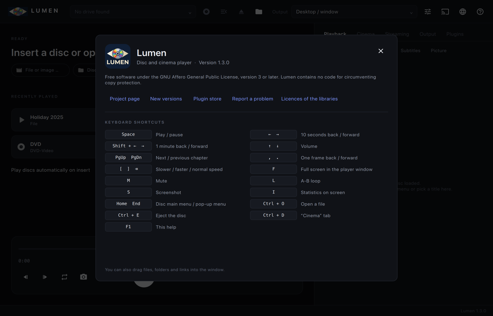

<p align="center"></p>

# Lumen – Disc & Digital Cinema Player

**English** · [Deutsch](README.de.md) · [Français](README.fr.md) · [Español](README.es.md) · [Italiano](README.it.md) · [Português](README.pt.md) · [Nederlands](README.nl.md) · [Polski](README.pl.md) · [Svenska](README.sv.md) · [Čeština](README.cs.md) · [Türkçe](README.tr.md) · [Українська](README.uk.md) · [Русский](README.ru.md) · [日本語](README.ja.md) · [简体中文](README.zh.md) · [한국어](README.ko.md)

A fast, minimalist player for home cinemas, screening rooms and small cinemas with **two windows**:

- **Player window** – native mpv window (gpu-next, D3D11/Vulkan/Wayland), can be pinned to an output device, HDR passthrough.
- **Control window** – Qt Quick: source, transport, titles, chapters, audio, subtitles, picture, cinema, streaming, output profiles, plugins.

Plays **Blu-ray / UHD / Blu-ray 3D, DVD-Video (with menus), HD DVD, Video-CD / Super Video-CD, Audio-CD,
Digital Cinema Packages (DCP, JPEG 2000, SMPTE and Interop, encrypted with KDM)** and every file format mpv can play.

> The interface is in English by default. On the start page you can switch between 16 languages: German, English, French,
> Spanish, Italian, Portuguese, Dutch, Polish, Swedish, Czech, Turkish, Ukrainian, Russian, Japanese, Simplified Chinese and Korean.
> English and German are maintained by hand; the other translations were made with machine assistance, corrections are welcome.

## Screenshots

<p align="center">
  
  
</p>
<p align="center">
  
  
</p>
<p align="center">
  
  
</p>

## Copy protection / encryption

Lumen **does not circumvent any copy protection**. Anything of that kind is the user's own choice and goes through
**[plugins](plugins/README.md)** the user installs and enables: a plugin can make user-provided libraries
(libaacs, libbdplus, libdvdcss) available to libbluray/libdvdread, register its own decrypting URL schemes, or
supply DCP keys. Lumen ships and downloads none of these.

- **Blu-ray:** discs are read exclusively through `libbluray`. If a disc is AACS/BD+ protected, this must already be
  handled outside of Lumen – e.g. a drive with LibreDrive firmware plus a user-installed AACS library that libbluray loads
  at runtime. The same applies to the second 3D view (`bd_open_file_dec`).
- **DVD:** discs are read through `libdvdread`/`libdvdnav`; Lumen contains no CSS code. The MSYS2 and Homebrew builds of
  libdvdread link `libdvdcss` directly. Lumen's Windows and macOS packages therefore contain **Lumen's own stand-in**
  (`src/dvdcss_shim.c`) under that name instead of libdvdcss. It reads sectors unchanged, so unencrypted discs, images
  and folders play. If the user adds a real libdvdcss through a plugin, the shim forwards to it
  (`LUMEN_DVDCSS_LIBRARY`).
- **HD DVD:** only unprotected (or already decrypted) discs play; AACS-protected HD DVDs are reported as such.
- **DCP:** encrypted DCPs are decrypted the way every cinema server does it – with a **KDM issued for this player's
  certificate** (see below). Without a matching, currently valid KDM (or keys the content owner entered themselves),
  encrypted content stays unreadable.

## Downloads

Precompiled releases are on the [Releases page](https://github.com/Karl-Lauterbach24/Lumen/releases), for
x86-64 (Intel/AMD) and ARM64 (Apple Silicon, Windows on ARM, Linux aarch64):

| System | x86-64 | ARM64 |
|--------|--------|-------|
| Windows 10/11, installer | `Lumen-<version>-windows-x64.msi` | `Lumen-<version>-windows-arm64.msi` |
| Windows 10/11, portable | `Lumen-<version>-windows-x64.zip` | `Lumen-<version>-windows-arm64.zip` |
| macOS 15 | `Lumen-<version>-macos-x64.dmg` (Intel) | `Lumen-<version>-macos-arm64.dmg` (Apple Silicon) |
| Debian 13 and derivatives | `Lumen-<version>-linux-amd64.deb` | `Lumen-<version>-linux-arm64.deb` |
| Fedora 44 | `Lumen-<version>-linux-x86_64.rpm` | `Lumen-<version>-linux-aarch64.rpm` |

- The MSI installs for all users with a Start menu entry and is removed through *Apps & features*.
- Linux: `sudo apt install ./Lumen-….deb` or `sudo dnf install ./Lumen-….rpm`; the package manager pulls in
  Qt 6 and the disc libraries.
- Every package contains the same media libraries, built from the same pinned sources: FFmpeg-mvc (with the
  Blu-ray 3D decoder), libmpv and x264. Blu-ray 3D and casting therefore work the same on all platforms.

Lumen checks for new releases at start, at most once a day and only if enabled. On Windows and macOS it
installs an update with one click, after verifying the download against the release's `SHA256SUMS.txt`;
on Linux it tells you that a new version exists and you install the new package. A copy installed with the
MSI updates itself with the new MSI (Windows asks for administrator rights), the portable copy with the ZIP.

## Streaming and media servers

The **Streaming** tab plays links of every kind mpv understands: HTTP(S) files, HLS (`.m3u8`), DASH (`.mpd`),
RTSP, RTMP, SRT, UDP and SMB. It keeps a history of recent links. Web pages such as YouTube play through
[yt-dlp](https://github.com/yt-dlp/yt-dlp) when it is installed next to Lumen or in the `PATH`.

Media servers:

| Server | Sign-in | Features |
|--------|---------|----------|
| **Jellyfin**, **Emby** | Username + password; only the access token is stored | Libraries, series/seasons/episodes, search, continue watching, posters, direct play from the resume position, progress reported to the server |
| **Plex** | *Sign in with Plex*, via a PIN in your own browser, or server URL + `X-Plex-Token` | Libraries, series/seasons/episodes, search, on deck, posters, direct play, progress reported through the timeline |

## Casting

The cast button in the control window sends the player's picture and sound to a TV or receiver on the same
network. Lumen encodes exactly what the player window would show (disc menus, subtitles and tone mapping
included) as H.264 with AAC stereo sound, 1080p or 720p, and serves it itself; you keep controlling playback
in Lumen.

| Receiver | How | Notes |
|----------|-----|-------|
| **DLNA / UPnP** renderers (most smart TVs) | found automatically (SSDP), or by the address of the device description | continuous MPEG-TS stream |
| **Chromecast / Google Cast** | found automatically (mDNS), or by IP address | HLS in the default media receiver |
| **AirPlay** | found automatically (mDNS), or by IP address | only receivers that accept video without pairing; most current Apple TVs and AirPlay 2 televisions refuse (Lumen says so) |
| **[Lumen TV](https://github.com/Karl-Lauterbach24/Lumen-TV)** apps: Android TV, Samsung Tizen, LG webOS | the app connects to Lumen and appears in the list | the TV remote operates Lumen: disc menus, pause, seeking |
| any **browser** | open the address the Cast dialog shows, e.g. `http://192.168.1.20:47800` | same receiver page as the TV apps |
| **Miracast**, AirPlay screen mirroring | button in the Cast dialog opens the system setting | the receiver becomes a normal screen; nothing is transcoded |

- The stream is live and arrives three to four seconds late over HLS. That is fine for films; disc menus react
  with that delay.
- HDR is tone-mapped to SDR, surround sound is mixed down to stereo, 3D is cast in 2D.
- Lumen listens on port 47800 only while the Cast dialog is open or a cast is running, unless you switch on
  *Stay reachable for Lumen TV apps*. The stream address contains a random token per session.
  The protocol of the TV apps is described in [docs/tv-protocol.md](docs/tv-protocol.md).
- Tested automatically against stand-ins for all four receiver types and by playing the stream in a desktop
  browser. **Not tested with a real TV, Chromecast, AirPlay or DLNA device.**

## Screens

With the output set to *Automatic* (the default), Lumen assigns screens itself:
- the player uses the screen with the most pixels (then refresh rate and HDR);
- the control window moves to the smallest remaining screen, e.g. the laptop next to a projector.

Plugging screens in or out updates the assignment. You can switch this off in the *Output* tab.

## Plugin store

The *Plugins* tab installs plugins from the official store
[Lumen-Plugins](https://github.com/Karl-Lauterbach24/Lumen-Plugins) and from your own sources. A source can be
`owner/repo`, a GitHub URL, or a URL or folder with an `index.json`. Every file is checked against its SHA-256 sum,
and newly installed plugins start disabled.

One plugin from the store is **Disc identification**: it names the disc you insert. Audio CDs get album,
artist, year, cover and track names from MusicBrainz; DVDs, Blu-rays and Video CDs get a film title and year
from the disc label via Wikidata. Without the plugin Lumen still shows CD-Text if the disc has it.

## Plugins

Folders with a `plugin.json`, managed in the **Plugins** tab (enable, disable, buttons, status). A plugin
can include any of these:
- a native C-ABI library ([`include/lumen/plugin.h`](include/lumen/plugin.h)): events, buttons, its own
  URL schemes as sources, DCP content keys, disc metadata, mpv commands/properties;
- mpv Lua/JavaScript scripts, which receive Lumen's events, can fetch URLs through Lumen and can set disc
  metadata and their status line;
- mpv options;
- environment variables;
- user-provided disc libraries.

Documentation and examples: [plugins/README.md](plugins/README.md).

## Features

| Area | Scope |
|---|---|
| Sources | Optical drives (auto-detection, vendor/model/firmware, eject, autoplay on insert), ISO (Blu-ray/DVD/HD DVD detected automatically), CUE/BIN/NRG images, disc folders (BDMV, VIDEO_TS, HVDVD_TS, MPEGAV/MPEG2), DCP folders and cinema drives, every format mpv can play |
| Blu-ray | Disc menus (HDMV, BD-J with Java), main feature, titles/playlists with duration, video/audio format, UHD and 3D detection |
| **Blu-ray 3D** | **Both views (MVC)**, output as HDMI Frame Packing 1080p, side-by-side / top-and-bottom (half/full), row-interleaved, anaglyph or 2D; subtitles and menus per eye with adjustable depth |
| **DVD-Video** | **Disc menus** via libdvdnav (root/title/audio/subtitle menus, buttons with keyboard, remote and mouse), stills, own subpicture decoder with the disc palette and button highlights, forced subtitles, multi-angle, languages from the IFO, region/language from system settings, title & chapter selection |
| **DCP** | SMPTE and Interop, OV/VF (supplemental packages in neighbouring folders), multi-reel CPLs with entry points, **JPEG 2000 (XYZ → display colour space)**, 24-bit PCM up to 16 channels, **encrypted DCPs (KDM, AES-128)**, subtitles (Interop XML and SMPTE Timed Text incl. encrypted MXF and embedded fonts → positioned ASS), **CPL markers as chapters** (FFOC, LFOC, FFEC, FFMC …), **3D DCPs**, hash verification against the PKL |
| HD DVD | Titles and chapters from the Advanced Content playlists (ADV_OBJ/*.XPL), EVO playback (VC-1/AVC/MPEG-2, DD+, DTS-HD, TrueHD) |
| Video-CD / SVCD | Sector-exact reading of Mode 2 Form 2 tracks via libcdio (drive or CUE/BIN/NRG), entry points (ENTRIES.VCD/SVD) as chapters, **PBC menus** (VCD 2.0 playback control: selection lists with number keys, play lists, Next/Previous/Return/Default, wait times, loops, segment stills), fallback via the file system |
| Audio-CD | Drives and images (CUE/BIN …) read through libcdio; tracks as chapters, names from CD-Text or a plugin |
| Transport | Play/pause, stop, ±10 s/±60 s, chapters, frame step back/forward, A-B loop, speed, scrubbing with chapter marks, screenshot, **show playlist** (ads, trailers, feature back to back) |
| Audio | Track selection, bitstream (TrueHD/Atmos, DTS-HD MA/DTS:X, DD+, DD), WASAPI exclusive, channel layout, audio delay, **night mode** (dynamic range compression), volume remembered; **cinema fader** (Dolby scale, 7.0 = reference) and **DCP channel routing** (5.1, 7.1 DS, HI, VI-N) |
| Subtitles | Track selection (PGS/SRT/ASS/VobSub/DCP), **external subtitle files**, forced only, delay, size, position (cinemascope screens) |
| Everyday use | **Recently played** on the start page (files resume where you stopped), **drag and drop** of files, folders and links, help dialog with all shortcuts (F1), window title shows what is playing |
| Picture | Aspect ratio, pan & scan, zoom, brightness/contrast/saturation/gamma, automatic deinterlacing, **automatic 3D detection for files** (side-by-side, top-and-bottom, MVC in MKV) or a format chosen by hand |
| Output profiles | Target device, fullscreen, refresh-rate matching, automatic system HDR, HDR passthrough or tone mapping, **reference scaling** (EWA Lanczos 4, error diffusion, HDR contrast recovery), **calibration** (system/own ICC profile, 3D LUT `.cube`, native contrast, dither depth, GLSL shaders), sync, 3D output format, audio device, expert options |

Presets: *Desktop*, *1080p DLP 3D projector* (half SBS), *1080p DLP 3D projector (Frame Packing)*,
**Cinema projector DCI-P3 (gamma 2.6, 48 cd/m²)**, **Mastering monitor P3-D65**,
*4K HDR LED projector (passthrough)*, *4K HDR LED projector (player tone mapping)*, *4K HDR TV (OLED)*, *Performance/Laptop*.

## Digital Cinema Packages

```
ASSETMAP ─> PKL ─> CPL (reels: picture | sound | subtitles | markers)
                     │
                     ├─ picture MXF ─ lumendcp:// (decrypts on read) ─ FFmpeg J2K ─ XYZ → display
                     ├─ sound MXF   ─ lumendcp://                    ─ PCM 24 bit ─ fader / channel routing
                     ├─ Atmos/IAB   ─ lumeniab:// (decrypt → DTS IAB renderer → 7.1.4/5.1.4/7.1/5.1/2.0)
                     ├─ subtitles   ─ Interop XML / SMPTE Timed Text  ─ positioned ASS (+ fonts)
                     └─ markers     ─ chapters
          all reels ─> one mpv EDL (3D: left + right eye → lavfi hstack → 3D output format)
```

- **Opening:** "Kino" tab → *DCP öffnen …*, the folder dialog, drag a DCP folder onto the command line, or plug in a
  cinema drive: DCPs in the root or one folder level down show up in the drive list.
- **Encrypted DCPs / KDM workflow**
  1. *Kino → Zertifikat erzeugen* creates a SMPTE ST 430-2 certificate chain (RSA 2048, SHA-256) for this player.
     Alternatively *Importieren …* uses an existing leaf certificate + private key (PEM), e.g. from DCP-o-matic.
  2. *Leaf exportieren* – send `lumen-leaf.pem` to the distributor / KDM creator.
  3. *KDM laden …* – the content keys are unwrapped with RSA-OAEP; KDMs are stored (still encrypted) in the
     configuration folder and unwrapped again on every start. Validity windows are checked; the CPL list shows
     "KDM gültig bis …", "abgelaufen" or "noch nicht gültig".
  4. Playback decrypts each KLV triplet (SMPTE ST 429-6, AES-128-CBC) on the fly. The decrypted triplet is replaced by
     *essence KLV + KLV fill of the same size*, so all index tables and partition offsets stay valid and seeking works.
     A wrong key is detected via the triplet check value.
  - For your own DCPs, *Schlüsseldatei …* accepts `<key id> <key hex>` lines (session only, not stored).
- **JPEG 2000 performance:** J2K has resolution levels. In *automatic* mode Lumen decodes only the level the output
  needs (4K DCP on a 2K/1080p output = half the work, no visible loss) and, if the CPU cannot keep up (dropped frames
  in the first 30 s), switches one level lower on the fly. Manual: full / half / quarter.
- **Sound:** 16-channel DCPs are routed per SMPTE 428-12 (L R C LFE Ls Rs · HI · VI-N · … · Lrs Rrs); *auto* uses 7.1 DS
  for 16 channels, 5.1 otherwise; HI and VI-N can be selected for accessibility. The fader follows the cinema processor
  scale (7.0 = 0 dB, 3.33 dB per step above 4).
- **Immersive audio (Dolby Atmos / SMPTE IAB):** Atmos DCP tracks (`AuxData`, ST 429-18) carry SMPTE ST 2098-2 IAB
  frames. Lumen reads them frame by frame (and decrypts them with the KDM key, type MDEK) and renders beds and objects
  with DTS's open [IAB renderer](https://github.com/DTSProAudio/iab-renderer) (BSD-3-Clause), using VBAP, onto
  **7.1.4, 5.1.4, 7.1, 5.1 or stereo** (*Kino → Atmos/IAB-Ausgabe*). mpv receives this as a 32-bit float WAV stream
  with a proper channel mask, and it becomes the preferred audio track of the composition. The PCM version stays
  selectable. The 5.1 and 7.1 layouts are derived from DTS's 5.1.4/7.1.4 configurations, with the heights folded down
  (`resources/iab`). The renderer is fetched automatically at build time (pinned commit), or from `-DIAB_SOURCE_DIR`;
  `-DLUMEN_WITH_IAB=OFF` builds without it.
- **Verification:** *Prüfen* hashes all track files of a CPL (SHA-1) and compares them with the packing list.
- **Show playlist:** add CPLs (*Ins Programm*) or the running source and play them back to back.

## Blu-ray 3D

```
libbluray bd_read_ext()  ── base view (PID 0x1011) ─────┐
                                                         ├─ MvcMerger ─ TS ─> mpv ─> FFmpeg-mvc ─> SBS frame
libbluray bd_open_file_dec() ─ dependent view (0x1012) ─┘   (paired per frame by PTS)             │
                                                                                                   v
                                         vf: stereo3d / frame-packing graph ─> format of the output profile
```

- **Decoder:** stock FFmpeg only decodes the base view. Lumen uses
  [FFmpeg-mvc](https://github.com/tthayer93/FFmpeg-mvc) (branch `release/9.0`), which decodes both views
  into one side-by-side frame. `tools/build_deps.sh` builds it, and libmpv against it, for every platform.
  Lumen detects the decoder by its version string (`…-mvc`).
- **Second view:** libbluray only delivers the base view. `MvcMerger` reads the playlist's SS sub-path
  (which clip), the CLPI EP map (seek points) and the dependent `.m2ts` via libbluray, pairs access
  units by PTS and appends the MVC NAL units to the base-view NAL units.
- **3D playback always goes through libbluray** (`lumenbd://`), including "main feature" and title selection.
  The disc is told "3D preferred" (PSR21/23) so that menus select the 3D playlist.
- **Subtitles/menus:** libbluray renders PG subtitles and menu graphics; Lumen draws them once per eye
  (adjustable depth in the profile or in the "Untertitel" tab).
- **Frame Packing (HDMI 1.4):** 1920×2205 (1080 + 45 + 1080 lines) @ 23.976 Hz. The display mode must
  be created as a custom resolution in the graphics driver; Lumen then switches to it automatically.
- There is no hardware decoding for MVC; detected 3D discs are decoded in software. Lumen's FFmpeg decodes
  the slices of a picture in parallel (a Blu-ray 3D carries six per picture and view): 263 picture pairs per
  second instead of 68 on an Apple M3 Pro for a 36 Mbit/s disc, the same pictures bit for bit.
- **Frame sequential for shutter glasses (experimental):** the output format *Frame sequential* shows one eye
  per display refresh. The pattern is free: `LR`, `LSRS` (a sync picture after each eye, an attempt to drive
  DLP-Link glasses from a fast TV), `LBRB` (black pictures), or your own string of L, R, S and B. Colour and
  brightness of the sync pictures, a trigger box in a screen corner for light-sensor emitters, eye swap, a
  phase shift and switching the display to the chosen rate (120 to 360 Hz) are set in the output profile.
  The picture sequences are tested; **whether any glasses lock onto them has not been tested**, and a single
  dropped frame swaps the eyes.

## 3D files

Lumen finds out by itself whether a file is 3D and how the two eyes are arranged (*Picture* tab, 3D source
*Automatic*). It asks four sources, in this order:

1. **What the file says:** Matroska `StereoMode`, MP4 `st3d`, H.264 frame-packing SEI, as read by mpv.
2. **The file name:** `3D`, `SBS`, `H-SBS`, `Half-SBS`, `FSBS`, `TAB`, `HTAB`, `OU`, `H-OU`, `Over-Under`,
   `Top-and-Bottom`, `RL` (right eye first). `SBS` alone also is a broadcaster's name, so without `3D` or a
   size prefix it only counts if the picture does not contradict; `OU` and `TAB` alone need a `3D` next to them.
3. **The picture:** up to seven frames spread over the running time are decoded and their halves compared
   (left/right and top/bottom, shifted against each other by up to 6 %, after removing everything that is
   constant along a row or a column, so that bars, stripes and letterboxing do not look like a second view).
   Two views of the same scene correlate at 0.75 to 0.98, ordinary pictures at about 0. Three frames without
   any similarity end the check early, which is the usual case and takes a fraction of a second.
4. **The frame size** (3840×1080, 1920×2160), only if the name says 3D and the picture could not be checked.

Whether each eye has the full or half the resolution follows from the shape of one half: narrower than 1.3:1
(side by side) or wider than 3:1 (top and bottom) means squeezed.

**MKV with two views (H.264/MVC,** e.g. made from a Blu-ray 3D): FFmpeg-mvc reports the profile *Stereo High*.
If the output profile is 3D, Lumen decodes both views (software decoder, FFmpeg's Matroska reader) and treats
the result like a full side-by-side file; with a 2D profile only the base view is decoded.

When the output profile is 3D or the name says 3D, the check runs **before** the file starts (it waits at
most 2.5 s), so playback begins in the right format. Otherwise it runs alongside loading, and the start waits
up to half a second for its result: a 3D file on a 2D profile begins as one eye instead of switching after a
second. A format chosen by hand switches the detection off.
Not detected: which eye comes first (left is assumed unless the name says `RL`), anaglyph, checkerboard.
`LUMEN_STEREO_DEBUG=1` prints every decision.

**Subtitles of a 3D file.** mpv draws subtitles once over the whole output picture. With side-by-side,
top-and-bottom or frame packing output that puts half of the text into each eye. For text subtitles (SRT, ASS,
WebVTT …) Lumen therefore draws the text itself, once per eye, squeezed like the picture, and moves it in front
of the screen by the profile's subtitle depth (the slider in the *Subtitles* tab changes it while playing). Styles and positions of the subtitle file are not kept (plain
text, bottom centre). Picture subtitles (PGS, VobSub, DVB – in nearly every 3D file made from a Blu-ray)
come from mpv only as the finished overlay, so Lumen reads the subtitle track of a local file a second time in
its own thread, decodes it with FFmpeg and draws each subtitle picture once per eye at its authored position.
The reader stays half a minute ahead of playback and starts over where playback jumps to. Network streams
keep mpv's rendering.

**H.264/MVC in MPEG-TS** (`.m2ts`, `.ts`, `.mts` with both views in one track, e.g. from a 3D camcorder): FFmpeg
reports only the base view's profile there, so the detection looks for the second view's NAL units in the
first packets. Such a stream is then decoded in software – no hardware decoder can handle it, not even its
base view, and the picture used to stay black.

## Hardware and performance

- **Scaling quality *Automatic*** picks the tier from the graphics hardware: *fast* when a software
  renderer is found (llvmpipe, SwiftShader, Microsoft Basic Render Driver), *balanced* on integrated
  graphics, *high* on graphics cards and Apple Silicon. The driver is asked once, through an OpenGL context
  without a window; the profile editor shows what it answered.
- **Hardware decoding *Automatic*** decodes on the graphics hardware and hands the pictures to the renderer
  directly. If a filter computes on the CPU (3D conversion), the decoder copies them to memory instead of
  sending them the long way round; for MVC it is off, no hardware decoder can do that. What the hardware
  cannot decode (unsupported codec, profile or size) falls back to the software decoder by itself.
- **Runtime adaptation** (*Adapt performance automatically* in the profile): once a second Lumen looks at the
  dropped and delayed frames. From 6 % over 3.5 s (or 25 % over 2 s) it steps down: the renderer one scaling
  tier at a time, down to *fast* without debanding and dithering; the software decoder first with shortcuts
  that do not show, then without the deblocking filter, finally by leaving out frames so that the sound does
  not run away. If the renderer reports its own timing, that decides which side is too slow; otherwise the
  two take turns, the decoder first for 4K and more. The control window shows what was taken back. The
  renderer level is remembered per profile and kind of material (size and frame rate) for 14 days.
- **Deinterlacing** is automatic for material flagged as interlaced; the switch in the *Picture* tab forces it.
- In its own window Lumen asks mpv for `gpu-next` and, if that cannot start, the older `gpu` renderer.
- **Start without lost frames.** A file is loaded paused and starts when its first picture is drawn; a
  software decoder gets as long again as it took for that picture, because its threads are still working on the
  next ones. Without this mpv drops the first pictures while the sound is already running. Frames are counted
  from that start on.
- **JPEG 2000 (DCP).** With Lumen's change to FFmpeg the decoder is 20 to 28 % faster. Measured on an Apple M3
  Pro (12 threads): 2K at 183 Mbit/s 50 pictures per second (before: 42), 4K at 271 Mbit/s 27 (before: about 22),
  4K at 293 Mbit/s 26 (before: 21). 4K at 24 pictures per second now plays at full resolution without dropped
  frames on that machine; before it did not.
- **JPEG 2000 on a slower machine.** The decoder can leave out the finest bit planes of every code block
  (`skip_planes`, Lumen's change to FFmpeg). The picture keeps its full resolution and differs from the full
  decode by less than an 8 bit output shows: 51 dB with two planes left out, 46 dB with four, at 2.0 and 3.5
  times the speed (2K). *Automatic* estimates the level from the bit rate and the number of cores when a DCP
  starts, steps on while frames are lost – two planes, four planes, then half and quarter resolution – and
  remembers for two weeks what the machine needed. The decoder is reconfigured in place, without restarting
  the composition. With one decoder thread (of an M3 Pro) a 2K DCP at 238 Mbit/s settled at half resolution
  after 7 seconds and lost no frame after that; with two threads it played at full resolution from the start.
- **Reel changes** in a DCP no longer drop frames: the decoder runs ahead in its own thread (mpv's decoder
  queue), which covers the moment it restarts for the next reel.
- `LUMEN_PERF_LOG=1` prints once a second: position, dropped and delayed frames, decoder path, levels taken back,
  and how often the embedded window was drawn. `LUMEN_QUIT_AFTER=<seconds>` ends the program by itself (test runs).

## DVD menus

- libdvdnav runs the DVD's virtual machine and feeds MPEG-PS to mpv via `lumendvd://`.
- mpv does not know the DVD palette, so Lumen replaces the subpicture packets in the stream with padding and decodes them
  itself (RLE, display control sequences, IFO palette, button highlight colours) – menus and subtitles are drawn as an
  overlay scaled to the video area, subtitles synchronised to the playback clock by PTS.
- Still-frame menus: a sequence end code is injected so the decoder shows the still immediately.
- Operation: arrows/Enter/mouse in the player window, D-pad in the control window, Home = root menu, End = title menu,
  buttons for audio/subtitle menu, "back" and angle switching.

## Architecture

```
src/MpvController   libmpv instance, event-driven property observation, profiles -> mpv options, source dispatch, show playlist
src/BlurayNav       libbluray as mpv stream "lumenbd://": menus, titles, 3D, overlays per eye
src/MvcMerger       Blu-ray 3D: mixes in the dependent view (SS sub-path, EP map, PTS pairing)
src/DvdNav          libdvdnav as mpv stream "lumendvd://": menus, SPU decoder, highlights, streams, angles
src/OpticalMedia    Video-CD/SVCD ("lumenvcd://", libcdio), Audio-CD, HD DVD (XPL playlists, EVO)
src/DcpPackage      DCP: ASSETMAP/PKL/CPL parser, MXF header probe (resolution, channels, 3D, encryption)
src/DcpCrypto       OpenSSL: certificate chain (SMPTE 430-2), KDM unwrap (RSA-OAEP), AES-128-CBC
src/DcpStream       "lumendcp://": MXF reader with size-preserving triplet decryption and eye filter
src/DcpSubtitles    Interop/SMPTE subtitles -> ASS, embedded fonts
src/DcpManager      DCP workflow for the UI: packages, keys, EDL/chapters, fader, routing, J2K levels, verification
src/DisplayManager  output devices, refresh / HDR / frame-packing mode (Windows, xrandr, kscreen-doctor, CoreGraphics)
src/DriveManager    drives/discs/cinema drives (worker thread), eject
src/DiscScanner     titles and status for Blu-ray, DVD, HD DVD, VCD, Audio-CD (worker thread)
src/PlayerWindow    embedded player window (mpv render API/OpenGL, drawn by its own thread), mainly for macOS
src/ProfileManager  presets + user profiles
src/Stereo3D        filter chains for the 3D output formats, incl. frame sequential
src/StereoDetect    automatic 3D detection: file name, container, picture comparison, MVC
src/StereoSubs      subtitles of 3D files, drawn once per eye
src/BitmapSubs      picture subtitles (PGS, VobSub) read and decoded in a thread of its own, for StereoSubs
src/Tuning          graphics hardware class, scaling tier and decoder path, runtime governor
src/CastManager     casting: session, settings, device list (QML "Cast")
src/CastRenderer    mpv render API into a framebuffer, read back for the encoder
src/CastEncoder     H.264 + AAC -> MPEG-TS segments (libavcodec/libavformat), own thread
src/CastAudio       places mpv's audio on the stream timeline (audio tap of Lumen's libmpv)
src/CastServer      HTTP: HLS, continuous TS, receiver page, Lumen TV protocol
src/CastDiscovery   SSDP (DLNA) and mDNS (Chromecast, AirPlay)
src/CastTargets     DLNA AVTransport, Chromecast CASTV2, AirPlay, Lumen TV
receiver/           receiver page for browsers and the TV apps
qml/                control window (CinemaPane.qml = "Kino" tab)
tools/              build/deploy scripts, test-disc/DCP/VCD generators
tests/              mvcmerge_test (MVC merging), dcp_test (DCP chain), cast_test (stream, receivers), ...
```

## Building

Lumen needs Qt ≥ 6.5 (Quick, QuickControls2, OpenGL, Xml), libbluray ≥ 1.2, CMake ≥ 3.21 and its media
libraries. Optional, enabled automatically when found: **OpenSSL ≥ 1.1** (encrypted DCPs), **libdvdnav ≥ 6**
(DVD menus), **libcdio + libiso9660** (Video-CD from drives and images).

**Media libraries.** `tools/build_deps.sh` builds x264, FFmpeg-mvc and mpv (and libdvdnav 7 where the system
has an older one) from pinned sources into `3rdparty/prefix`; CMake picks that prefix up by itself. The
versions are set at the top of the script, once for all platforms. mpv gets three small changes
([`tools/patches`](tools/patches)): a fix for the scalers' weight table (uninitialized padding, which gave
a black picture with software OpenGL), and its timed null audio output can also write the samples to a pipe, with the
time each block is played. Casting needs that; a stock libmpv plays everything else, but the cast button is
disabled. The third makes the sound start when an audio device refuses bitstream output: mpv falls back to
decoding, but nobody asked the decoder for data any more and playback stayed at 0:00. FFmpeg gets two changes. The JPEG 2000 decoder (DCP) runs its inverse wavelet transform over
neighbouring memory instead of down single columns, and the arithmetic decoder is inlined into the coding
passes; the decoded pictures are the same bit for bit. It also gets the option `skip_planes` (see *Hardware and
performance*). The MVC decoder (Blu-ray 3D) keeps slice threading when it delivers both views, and two faults
in it are fixed: a dependent-view slice whose data ends in a lone stop byte lost that byte and was replaced by
a copy of the other eye (a band of the right eye wrong for a whole group of pictures), and after a short
group of pictures the two views left the decoder in different order (one picture pair delivered as two
pictures with one eye black).

Everything else (Qt, libass, libplacebo, libbluray ...) comes from the platform's package manager. The exact
package lists are in the workflows: [`release.yml`](.github/workflows/release.yml) (Windows, macOS) and
[`linux.yml`](.github/workflows/linux.yml).

### Windows (MSYS2 UCRT64, or CLANGARM64 on ARM)

```bash
pacman -S --needed git make diffutils perl
pacboy -S --needed toolchain:p cmake:p ninja:p pkgconf:p python:p nasm:p meson:p dav1d:p \
    qt6-base:p qt6-declarative:p qt6-svg:p qt6-imageformats:p qt6-tools:p libbluray:p libdvdnav:p libcdio:p \
    openssl:p libxml2:p libass:p libplacebo:p lua51:p lcms2:p libarchive:p libjpeg-turbo:p uchardet:p zimg:p \
    rubberband:p vulkan-headers:p vulkan-loader:p shaderc:p spirv-cross:p
SRCROOT=/c/lumen-deps tools/build_deps.sh          # short path: Windows' 260 character limit
cmake -S . -B build -G Ninja -DCMAKE_BUILD_TYPE=Release -DCMAKE_PREFIX_PATH=$MINGW_PREFIX \
      -DBLURAY_ROOT=$MINGW_PREFIX -DLUMEN_DEPLOY_SEARCH=$MINGW_PREFIX/bin
cmake --build build      # the post-build step collects Qt and all DLLs next to lumen.exe
```

### Linux

```bash
# Debian/Ubuntu: see the package list in .github/workflows/linux.yml (Fedora: the dnf list there)
tools/build_deps.sh
cmake -S . -B build -G Ninja -DCMAKE_BUILD_TYPE=Release -DCMAKE_INSTALL_PREFIX=/usr
cmake --build build
(cd build && cpack -G DEB)     # or RPM; the media libraries are installed privately in /usr/lib/lumen
```

### macOS

```bash
brew install qt libbluray libdvdnav libdvdread libcdio openssl@3 libxml2 pkgconf ninja meson nasm \
     dav1d libass libplacebo luajit little-cms2 libarchive jpeg-turbo uchardet zimg rubberband xz
tools/build_deps.sh
cmake -S . -B build -G Ninja -DCMAKE_BUILD_TYPE=Release -DCMAKE_PREFIX_PATH=$(brew --prefix qt)
cmake --build build                      # build/Lumen.app
cmake --build build --target lumen_dmg   # self-contained Lumen.app + Lumen.dmg (macdeployqt)
```
libmpv can't open its own window on macOS, so the player window is always the embedded one (mpv render API,
OpenGL 3.2 Core, SDR); refresh-rate switching uses CoreGraphics, HDR is left to macOS.

### Checking a build

`lumen --selftest out.json` writes what the loaded libraries can do (FFmpeg and mpv version, MVC decoder,
H.264 encoder, audio tap, Lua, libbluray, libdvdnav) and exits. The package builds run it on every platform.

## Tests

```bash
cmake -DLUMEN_BUILD_TESTS=ON …        # builds mvcmerge_test and dcp_test

# Blu-ray 3D: synthetic 3D disc from the MVC test stream tests/data/mvc8.h264 -> merge both views ->
# decode with the FFmpeg in PATH -> every frame must have left eye luma 165, right eye 36
tools/test_bd3d.sh build build/tests/bd3d

# Frame-sequential 3D: the filter chains for the patterns (L R, L S R S, trigger box ...) applied with FFmpeg
tools/test_seq3d.sh build build/tests/seq3d

# 3D detection: file names, container tags and sizes; then generated clips (two shifted views side by side
# and on top of each other, and 2D pictures that must not pass: colour bars, test card, letterbox, fractal)
tools/test_stereodetect.sh build build/tests/stereodetect
stereodetect_test movie.mkv sbs2l                     # one file: scores per frame and the result

# Hardware class from driver strings, scaling tier and decoder path, the governor fed with drop counters
tuning_test

# Casting: real stream read back over HTTP (H.264/AAC, orientation, frame rate, audio/video sync from a clip
# with a flash and a beep every second), device discovery, DLNA, Chromecast, AirPlay and a TV app against
# tools/mock_cast_devices.py. Needs OpenGL (under Linux CI: Xvfb + Mesa, with LUMEN_CAST_SIZE=320x180)
cast_test python3 tools/mock_cast_devices.py openssl sync.mp4

# DCP: certificate -> encrypted test DCP + KDM -> unwrap -> decrypt -> play (libmpv, vo=null)
dcp_test gencert id                                   # id/leaf.pem, id/leaf.key
python tools/make_test_dcp.py ffmpeg openssl dcp --encrypt id/leaf.pem
dcp_test info dcp                                     # reels, entry points, key IDs, MXF header
dcp_test kdm dcp/kdm.xml id/leaf.key                  # == dcp/keys.txt
dcp_test decrypt dcp/picture.mxf <key> plain.mxf      # frames identical to the unencrypted source; wrong key -> check value errors
dcp_test play dcp dcp/kdm.xml id/leaf.key 1.5         # loaded=1 … keyErrors=0
dcp_test subs dcp                                     # generated ASS

# Atmos/IAB: IAB frames (DTS packer) -> encrypted DCP track -> render + check every layout -> play through mpv
iab_testgen iab.bin 48
python tools/make_test_dcp.py ffmpeg openssl atmos --encrypt id/leaf.pem --iab iab.bin
dcp_test iab atmos/atmos.mxf <key> 7.1.4 --check       # object L -> RFH, LFE tone, 0 frame errors
dcp_test play atmos atmos/kdm.xml id/leaf.key 1.5 --iab # audio-ch=12

# Plugins: examples in <build>/plugins
plugin_test <build>/plugins dcp                       # native + script plugin, xorfile://, DCP key from plugin

# Video-CD with PBC menus (authored with vcdxbuild from GNU VCDImager)
python tools/make_test_vcd_pbc.py ffmpeg vcdxbuild vcd && vcd_test vcd/pbc.cue

# Video-CD: CUE/BIN image with Mode 2 Form 2 track
python tools/make_test_vcd.py ffmpeg vcd && lumen vcd/vcd.cue
```

Developer aids: `LUMEN_SNAPSHOT=shot.png` (optionally `LUMEN_SNAPSHOT_DELAY=ms`) saves the control window as an image;
`LUMEN_MPV_LOG=warn|info|v` forwards mpv's log (with `QT_FORCE_STDERR_LOGGING=1` on Windows);
`LUMEN_APP_NAME=LumenDev` keeps settings, profiles and history of a test run apart from the installed Lumen;
`LUMEN_GPU="llvmpipe"` pretends a graphics driver; `LUMEN_STEREO_DEBUG=1` prints the 3D detection's decisions.

## Command line

```bash
lumen D:\                      # drive: detects Blu-ray / DVD / HD DVD / VCD / Audio-CD and plays the main feature
lumen --menu D:\               # with disc menu (Blu-ray, DVD; e.g. for HTPC launchers)
lumen --menu Movie.iso         # ISO (Blu-ray, DVD or HD DVD) / disc folder with menu
lumen VideoCD.cue              # Video-CD / SVCD image
lumen E:\DCP\Feature_FTR       # DCP folder: plays the first (feature) CPL
lumen --kdm feature.xml E:\DCP\Feature_FTR   # load a KDM first
lumen movie.mkv                # any file mpv can play
```

## Keyboard

| Key | Control window | Player window |
|---|---|---|
| Space | Play/pause | Play/pause |
| ← / → (Shift) | ±10 s (±60 s), in menus: navigate | ±10 s, in menus: navigate |
| ↑ / ↓ | Volume, in menus: navigate | ±60 s, in menus: navigate |
| Enter / click | In menus: confirm | In menus: confirm, otherwise Enter = fullscreen |
| Home / End | Top menu / pop-up menu (DVD: title menu) | Top menu / pop-up menu (DVD: title menu) |
| Page up / down | Next / previous chapter | Next / previous chapter |
| , / . | Frame step | Frame step |
| F / double-click | Fullscreen | Fullscreen (Enter / double-click) |
| L | A-B loop | A-B loop |
| S | Screenshot | Screenshot |
| I | Statistics overlay | Statistics overlay |
| [ / ] / ⌫ | Speed ∓ / reset | |
| Ctrl+O / Ctrl+E / Ctrl+D | Open / eject / "Kino" tab | |

## Blu-ray disc menus

- libbluray runs the disc's menu program and feeds the stream to mpv via `lumenbd://`;
  menu graphics (IG or BD-J) arrive as an ARGB overlay scaled to the video area (per eye in 3D mode).
- Audio/subtitle choices made in the disc menu are mapped via the stream PID to the matching track.
- **BD-J menus** need a Java runtime (JRE ≥ 8) and `libbluray-j2se-*.jar`; without them, title mode remains available.

## Limitations / status

| Topic | Status |
|---|---|
| Blu-ray 3D | Implemented and tested end-to-end with a synthetic 3D disc (merge, seek, SBS, frame packing); the MVC decoder test runs for every package. **Not yet tested with a real 3D disc**. FFmpeg-mvc is an experimental fork. |
| Frame-sequential 3D | Experimental. The picture sequences are tested with FFmpeg. **Not tested with shutter glasses, DLP-Link glasses, a sensor emitter or a 120 Hz display.** |
| Casting | Stream, discovery and all four protocols are tested against stand-ins, playback in a desktop browser. **Not tested with real receivers.** AirPlay only without pairing. SDR, stereo, 2D; three to four seconds of delay over HLS. |
| DCP | Tested end-to-end with synthetic SMPTE DCPs on Windows and macOS (CI). The test DCPs have 2 reels with entry points, markers, Interop text and image subtitles, closed captions, a signed KDM, 3D, and an Atmos/IAB track. All essence is encrypted, and decrypted frames are bit-identical to the source. The IAB object and bed positions are checked per speaker for every layout. **Not yet tested with real cinema DCPs/KDMs or real Atmos mixes.** Not supported: forensic marking. Atmos tracks from before the SMPTE standard may contain elements the IAB renderer rejects (untested). |
| JPEG 2000 | Software decoding (FFmpeg, frame + slice threads). A DCP at full bit rate needs many cores: the M3 Pro (12) decodes 2K at 238 Mbit/s at 38 pictures per second, the CI machines (3–4 cores) at 5 to 14. On slower machines Lumen leaves out bit planes first and lowers the resolution after that; **measured only with one decoder thread to four on the M3 Pro, not on a slow machine itself.** |
| DVD | Menu navigation, SPU decoding and highlights are implemented but **not yet tested with real DVDs** (no DVD authoring tools available in the build environment). Without libdvdnav, DVDs play via mpv `dvd://` (no menus). |
| HD DVD | Tested with a synthetic HVDVD_TS/XPL structure. HDi interactivity (menus) is not supported; titles/chapters come from the playlist. AACS-protected discs do not play. |
| Video-CD | Playback control (PBC) is tested with a VCD 2.0 authored with GNU VCDImager's `vcdxbuild`, on Windows and macOS. The test covers selection by number, Default, Next/Prev/Return, automatic continuation, entry points and segment menus. Not supported: SVCD extended selection areas (mouse areas) and command lists. **Not yet tested with a real pressed VCD.** |
| Frame packing | Requires a 1920×2205 mode in the graphics driver; whether the projector recognizes it as 3D without an HDMI 3D InfoFrame depends on the device. |
| Dolby Vision | Detected (profile 5/7/8), gpu-next applies the RPU metadata; no PC player can output a real DV signal over HDMI. |
| Refresh/HDR switching | Windows: refresh + HDR · Linux X11: refresh (xrandr) · KDE Plasma: refresh + HDR · GNOME Wayland: display only · macOS: refresh |
| Embedded player window | Automatic on macOS, otherwise per profile; OpenGL render API → SDR only. |

## License

Lumen is free software under the **GNU Affero General Public License v3.0 or later** ([LICENSE](LICENSE)). Components and their licenses: [THIRD_PARTY.md](THIRD_PARTY.md).
