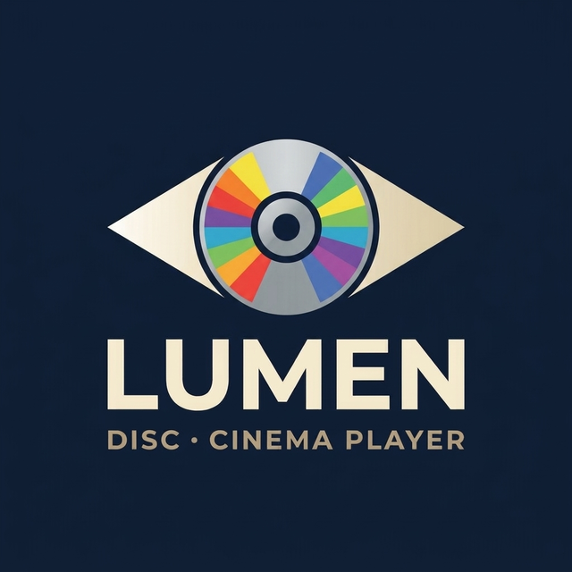
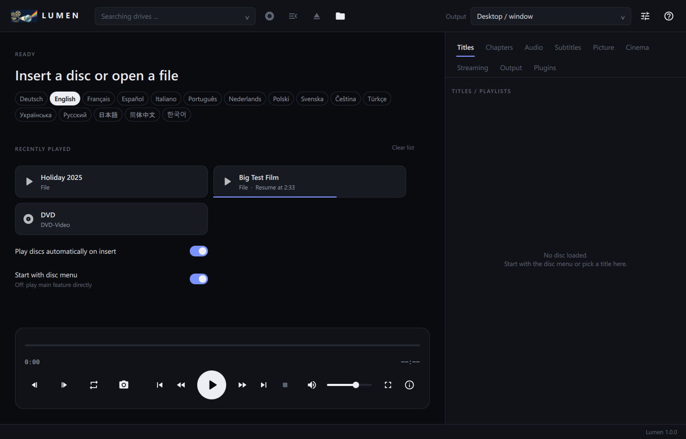
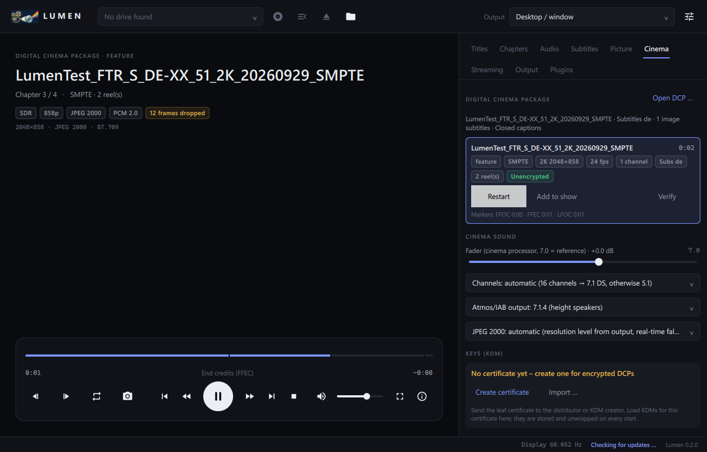

# Lumen – Speler voor schijven en digitale cinema

[English](README.md) · [Deutsch](README.de.md) · [Français](README.fr.md) · [Español](README.es.md) · [Italiano](README.it.md) · [Português](README.pt.md) · **Nederlands** · [Polski](README.pl.md) · [Svenska](README.sv.md) · [Čeština](README.cs.md) · [Türkçe](README.tr.md) · [Українська](README.uk.md) · [Русский](README.ru.md) · [日本語](README.ja.md) · [简体中文](README.zh.md) · [한국어](README.ko.md)

Een snelle, minimalistische speler voor thuisbioscopen, vertoningsruimtes en kleine bioscopen, met **twee vensters**:

- **Spelervenster** – eigen mpv-venster (gpu-next, D3D11/Vulkan/Wayland), vast te zetten op een uitvoerapparaat, HDR-passthrough.
- **Bedieningsvenster** – bron, transport, titels, hoofdstukken, audio, ondertitels, beeld, bioscoop, streaming, uitvoerprofielen en plug-ins.

Lumen speelt **Blu-ray / UHD / Blu-ray 3D, dvd-video met menu's, HD DVD, video-cd, audio-cd, Digital Cinema Packages (DCP)**, streams en elk bestandsformaat dat mpv kan afspelen.

  
  

## Downloads

Kant-en-klare pakketten staan op de [releasepagina](https://github.com/Karl-Lauterbach24/Lumen/releases):

| Systeem | Bestand |
|---|---|
| Windows 10/11 (x64, ARM64) | `Lumen-<version>-windows-x64.msi`, `…-windows-arm64.msi` (installatieprogramma) · `.zip` (draagbaar) |
| macOS 15 (Apple Silicon, Intel) | `Lumen-<version>-macos-arm64.dmg`, `…-macos-x64.dmg` |
| Debian 13 (x86-64, ARM64) | `Lumen-<version>-linux-amd64.deb`, `…-linux-arm64.deb` |
| Fedora 44 (x86-64, ARM64) | `Lumen-<version>-linux-x86_64.rpm`, `…-linux-aarch64.rpm` |

De Linux-pakketten gebruiken Qt 6, libmpv en de schijfbibliotheken van je distributie. Lumen controleert op nieuwe versies en installeert ze onder Windows en macOS met één klik, na controle van de controlesom.

## Mogelijkheden

- **Schijven:** Blu-ray en dvd met schijfmenu's, titels, hoofdstukken, audio- en ondertitelsporen; stations worden automatisch herkend.
- **Digitale cinema:** DCP met JPEG 2000, SMPTE en Interop, versleutelde pakketten met KDM, weergave van Dolby Atmos/IAB, vertoningsprogramma's.
- **Streaming:** allerlei links (HLS, DASH, RTSP, …) en de mediaservers Jellyfin, Emby en Plex.
- **3D:** Blu-ray 3D (MVC) als frame packing, side-by-side, top-and-bottom of anaglyph.
- **Uitvoerprofielen:** doelscherm, aanpassing van de verversingsfrequentie, HDR-passthrough of tone mapping, kalibratie (ICC, 3D-LUT).
- **Audio:** bitstream naar een AV-receiver (TrueHD/Atmos, DTS-HD), nachtmodus, vertraging en snelheid.
- **Audio-cd:** tracknamen uit cd-tekst of, met de plug-in *Disc identification*, van MusicBrainz.
- **Dagelijks gebruik:** lijst met onlangs afgespeelde items met hervatten, slepen en neerzetten, externe ondertitelbestanden, sneltoetsen (F1).
- **Interface in 16 talen**, te kiezen op de startpagina.

## Kopieerbeveiliging

Lumen bevat **geen** omzeiling van kopieerbeveiliging. Beveiligde schijven (AACS, BD+, CSS) spelen alleen af als je de benodigde bibliotheken zelf via een plug-in toevoegt; je bent er zelf verantwoordelijk voor dat dit in jouw land is toegestaan.

## Plug-ins

Plug-ins voegen bronnen, sleutels, scripts en functies toe. Het tabblad **Plug-ins** installeert ze uit de [plug-inwinkel](https://github.com/Karl-Lauterbach24/Lumen-Plugins) of uit je eigen bronnen; elk bestand wordt met zijn controlesom gecontroleerd.

## Meer

Bouwen vanuit de broncode, architectuur, tests, opdrachtregel en alle sneltoetsen staan in de [Engelse README](README.md). Deze vertaling is met machinale hulp gemaakt; verbeteringen zijn welkom.

## Licentie

Lumen is vrije software onder de **GNU Affero General Public License v3.0 of later** ([LICENSE](LICENSE)). Componenten en licenties: [THIRD_PARTY.md](THIRD_PARTY.md).
